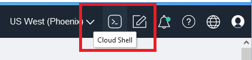

# Clean Up

## Introduction

This lab is finished. We wil delete all resources created.

## Task 1: Delete resources created using Cloud Shell

In this task we will deleted the resource created using the Cloud Shell.

1. Open the **Cloud Shell** in the top right menu.
to get the Cloud Shell started.

    

2. Execute the following in your Cloud Shell.

    ````
    <copy>
    source ~/serverless-with-nosql-database/env.sh
    fn delete function $APP_NAME demo-keyval-load
    fn delete function $APP_NAME demo-load
    fn delete function $APP_NAME demo-api
    fn delete function $APP_NAME load-target
    </copy>
    ````
    ````
    <copy>
    cd $HOME
    rm -rf serverless-with-nosql-database
    rm -rf BaggageData
    rm -rf info.json  NoSQLLabPrivateKey.pem  NoSQLLabPublicKey.pem
    </copy>
    ````

3. Exit from Cloud Shell

## Task 2: Delete resources created using Console


This task deletes the resources that got created.

1. On the top left, go to menu, then Databases, then under Oracle NoSQL Database, hit 'Tables'
Set your compartment to 'demonosql'
Click on the freeTest table, which will bring up the table details screen.  Hit Delete.

  

  Deleting tables is an async operation, so you will not immediately see the results on the OCI console.  Eventually the status of the tables will get changed to deleted.  

2. On the top left, go to menu, then Developer Services and then API Management

   In the Gateways screen, click on the gateway with the name BaggageTracking
   On the left choose Deployments, and delete the deployments

   

   When the status changed from Deleting to Deleted, proceed to delete the API Gateway

   

   Wait until the status changed from Deleting to Deleted

   


3. On the top left, go to menu,  then Analytics & AI and then Messaging

  In the Streams screen, choose the Streams with the name BaggageTracking and delete the Stream

  

  Wait until the status changed from Deleting to Deleted

  In the Stream Pools screen, choose the Stream Pool with the name DefaultPool and delete the Stream Pool

  

  Wait until the status changed from Deleting to Deleted

  In the Service Connector screen, choose the Service Connector with the name BaggageTracking and delete.

  

  Wait until the status changed from Deleting to Deleted

4. On the top left, go to menu,  then Identity & Security and then Policies

  In the policies screen, choose the 2 policies with the name ConnectorPolicy_functions* and delete them.

  


## Task 3: Delete resources created using Resource Manager - terraform


1.  Clean up from the deployment.   In the top left corner, hit the OCI drop down menu, then go to 'Developer Services' and then Stacks under Resource manager.

  

2.  In the Stacks screen, click on the stack with the name serverless-with-nosql-database.zip-xxxxxx.

  

3.  This will bring you to the stacks detail page.  On that screen hit the 'Destroy' button.  This will then pop up another window where you will have to hit 'Destroy' again.    This process takes 4-5 minutes to run and clean everything up.  

  

4.  When the destroy task will show Succeeded, return to the stack page.

5. Click on more actions and delete stack  

    

## Acknowledgements
* **Author** - Dario Vega, Product Manager, NoSQL Product Management and Michael Brey, Director, NoSQL Product Development
* **Last Updated By/Date** - Michael Brey, Director, NoSQL Product Development, September 2021
