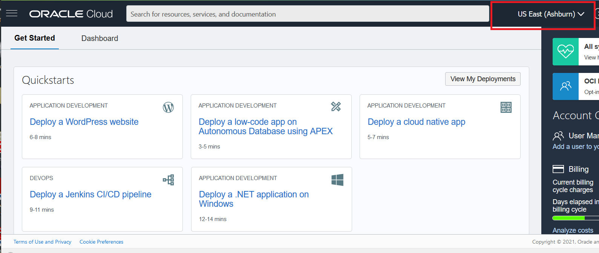

# Explore Data and Run Queries

## Introduction

This lab picks up where lab 4 left off.   We are going to use the functions created, deploy and execute queries using API Gateway.  

A common requirement is to build an API with serverless functions on the backend,
and an API gateway providing front-end access to those functions. This is the scenario
that we want to illustrate. We created a demo-api function which reads data from a NoSQL table,
implementing part of the logic tier.

The API Gateway service enables you to publish APIs with private endpoints that
are accessible from within your network, or exposed with public IP addresses if
you want them to accept internet traffic. The endpoints support API validation,
request and response transformation, CORS, authentication and authorization,
and request limiting. You can access the API Gateway service to define API gateways
and API deployments using the OCI Console and the REST API.

Oracle Functions enables you to create serverless functions that are built as Docker
images and pushed to a specified Docker registry.
You can add Oracle Functions to an API deployment specification by using the Console.
You can also do this by using a JSON file.

You can  specify a particular custom domain name for an API gateway.
The API gateways you create with the API Gateway service are TLS-enabled, and therefore
require TLS certificates (formerly SSL certificates) issued by a Certificate
Authority to secure them. To specify a particular custom domain name for an API gateway,
you must obtain a custom TLS certificate from a Certificate Authority,
rather than have the API Gateway service obtain a TLS certificate for you.

Finally, Apiary provides you with the ability to design APIs using either API Blueprint or Swagger.
From these description files, Oracle Apiary generates interactive documentation and a
console for making calls to the APIs from the UI. Apiary interactive documentation is an
interactive representation of your API Description for you to not only read and write,
but to be a place which allows you to completely interact with your API —even before you’ve built it.

Apiary was used in our project as a very powerful tool for Collaboration and Interactions.

[https://ndcsbaggagetrackingdemo.docs.apiary.io/#](https://ndcsbaggagetrackingdemo.docs.apiary.io/#)

Estimated Time: 25 minutes

### Objectives

* Deploy an API Gateway
* Read data with REST api through the API Gateway

### Prerequisites

* An Oracle Free Tier, Always Free, or Paid Cloud Account
* Working knowledge of API


## Task 1: Deploy an API Gateway

1. Log into the OCI console using your tenancy.

    

2. On left side drop down (left of Oracle Cloud banner), go to Developer Services and then API Management.

    

3. Click on Create Gateway. This opens up a new window.

  Enter **BaggageTracking** as  name, keep **Public** as a Type and choose the network - public subnet.
  Other information does not need to be changed for this LiveLab.

    

4. Wait few second until the API Gateway is created - Status will change from **Creating** to **Active**

    

5. On the left choose Deployments. Click on Create Deployment. This opens up a new window.

  Use the From Scratch wizard. Enter **BaggageTracking** as  name, **/BaggageDemo** as path prefix and click Next
  Other information does not need to be changed for this LiveLab.

  

5. Choose "No Authentication" and click Next
  this LiveLab will not configure security options.

  

6. Enter **/{api}** as a Path, Choose **GET** as a Method, Choose **Oracle Functions** as Backend Type,
Choose nosql_demos as Application and then demo-api as a Function Name, and click Next
Other information does not need to be changed for this LiveLab.

  

7. Review and Click on create

  

8. Wait few second until the deployment is created - Status will change from **Creating** to **Active**

  

## Task 2: Restart the Cloud Shell

1. Lets get back into the Cloud Shell.  From the previous lab, you may have minimized
it in which case you need to enlarge it.  It is possible it may have become disconnected
and/or timed out.   In that case, restart it.

    

2. Execute the following environment setup shell script in the Cloud Shell to set up your environment.

    ```
    <copy>
    source ~/serverless-with-nosql-database/env.sh
    </copy>
    ```

## Task 3: Read Data Using a Node.js Application via the API Gatewau

When the configuration is finished, you can test the endpoints to retrieve Data
using your favorite API Browser, your standard WEB Browser or simulate traffic
using API calls from a linux system:

1. We will call the getBagInfoByTicketNumber endpoint.   Execute in Cloud Shell one at a time so you can see the results.
    ```
    <copy>
    HOSTAPI=`oci api-gateway gateway list --compartment-id $NOSQL_COMP_ID --lifecycle-state ACTIVE --display-name BaggageTracking | jq -r '."data".items[]."hostname"'`
    URL="https://$HOSTAPI/BaggageDemo/getBagInfoByTicketNumber"
    echo $URL
    </copy>
    ```
    ```
    <copy>
    curl $URL?ticketNo=1762386738153 | jq
    </copy>
    ```
    ```
    <copy>
    curl $URL | jq
    </copy>
    ```
    ```
    <copy>
    curl $URL | jq '. | length'
    </copy>
    ```

  Each of these produced slightly different results.   The first one display the document with a specific ticket number,
  the second displayed all the records and the third gave a count of the records.

3. Now, lets test another one of the endpoints in the function. Execute in Cloud Shell.

    ```
    <copy>
    URL="https://$HOSTAPI/BaggageDemo/getPassengersAffectedByFlight"
    echo $URL
    </copy>
    ```
    ```
    <copy>
    curl $URL | jq
    </copy>
    ```    

  As you can see the field "message" the getPassengersAffectedByFlight endpoint is still under construction.  
  In other words the code for that endpoint has not been completed yet.

## Learn More


* [Oracle NoSQL Database Cloud Service page](https://www.oracle.com/database/nosql-cloud.html)
* [About Oracle NoSQL Database Cloud Service](https://docs.oracle.com/pls/topic/lookup?ctx=cloud&id=CSNSD-GUID-88373C12-018E-4628-B241-2DFCB7B16DE8)
* [About Functions](https://docs.oracle.com/en-us/iaas/Content/Functions/Concepts/functionsoverview.htm)
* [About API Gateway](https://docs.oracle.com/en-us/iaas/Content/APIGateway/home.htm)
* [About Cloud Shell](https://docs.oracle.com/en-us/iaas/Content/API/Concepts/cloudshellintro.htm)


## Acknowledgements
* **Author** - Dario Vega, Product Manager, NoSQL Product Management and Michael Brey, Director, NoSQL Product Development
* **Last Updated By/Date** - Michael Brey, Director, NoSQL Product Development, September 2021
