# Explore Data and Run Queries

## Introduction

This lab picks up where lab 4 left off.   We are going to use the functions created, deploy and execute queries using Connector Hub and Streaming.  

Service Connector Hub is a cloud message bus platform that offers a single pane
of glass for describing, executing, and monitoring movement of data between
services in Oracle Cloud Infrastructure.

Service Connector Hub orchestrates data movement between services in the Oracle
Cloud Infrastructure.

This scenario involves creating the load-target function and then referencing that
function in a service connector (Service Connector Hub) to process and
move baggage data from the "Streaming" source to a NoSQL table.

Estimated Time: 25 minutes

### Objectives

* Create the Stream
* Create and configure the Service Connector
* Simulate real-time traffic

### Prerequisites

* An Oracle Free Tier, Always Free, or Paid Cloud Account


## Task 1: Create the Stream

1. Log into the OCI console using your tenancy.  

    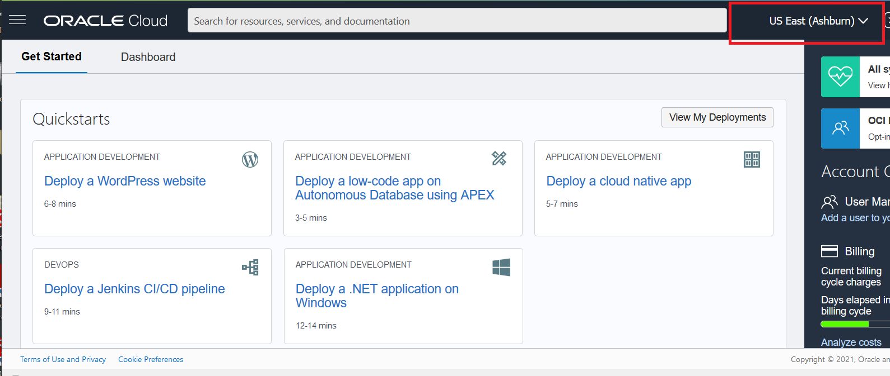

2. On left side drop down (left of Oracle Cloud banner), go to Analytics & AI and then Messaging.

    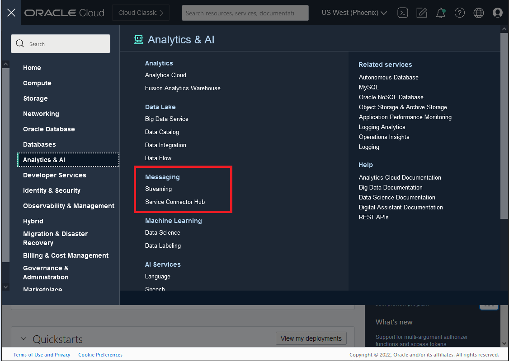

3. Click on Create Stream. This opens up a new window.

  Enter **BaggageTracking** as  name, keep **Auto-Create a default stream pool** and click on create.
  Other information does not need to be changed for this LiveLab.

    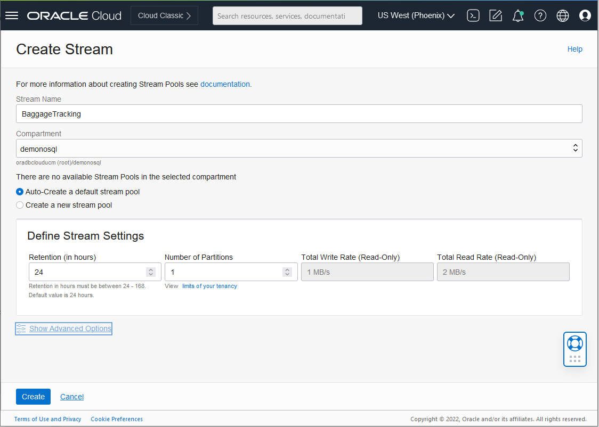

4. Wait few second until the stream is created - Status will change from **Creating** to **Active**

    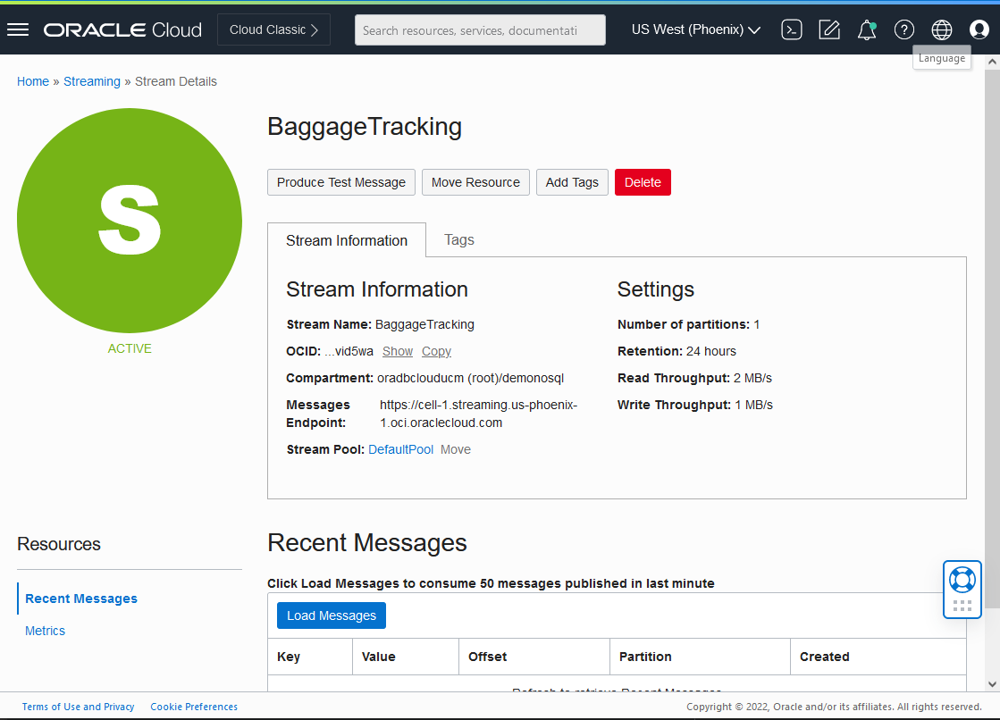

## Task 2: Create Service Connector

1. Log into the OCI console using your tenancy.  

  

2. On left side drop down (left of Oracle Cloud banner), go to Analytics & AI and then Messaging.

    

3. On the left choose Service Connectors. Click on Create Service Connector. This opens up a new window.

      Enter **BaggageTracking** as  name and description. Choose streaming as a source and functions as a target

      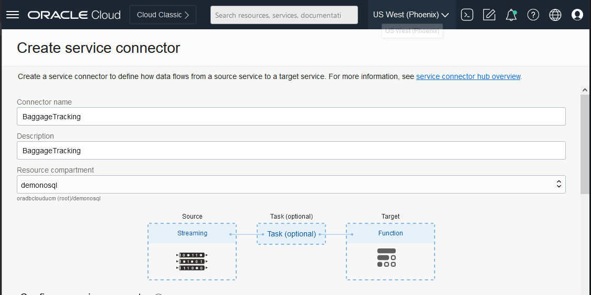

      In the Configure source section Choose **Default Pool** for stream pool and **BaggageTracking** for Stream

      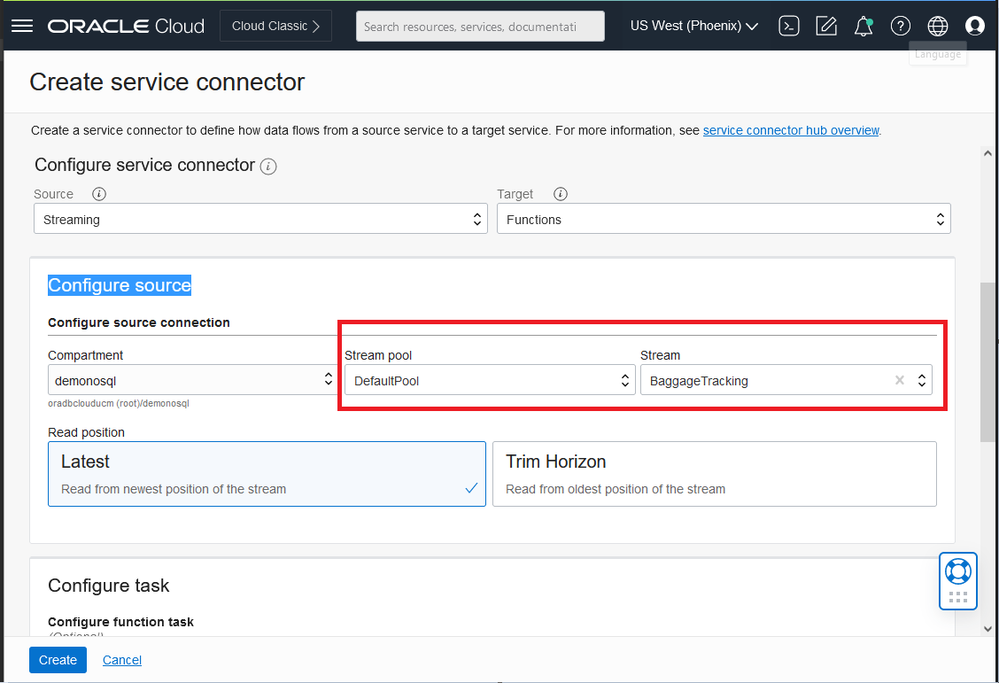

      In the Configure target section Choose **nosql demos** for Function Application and **load-target** for Function

      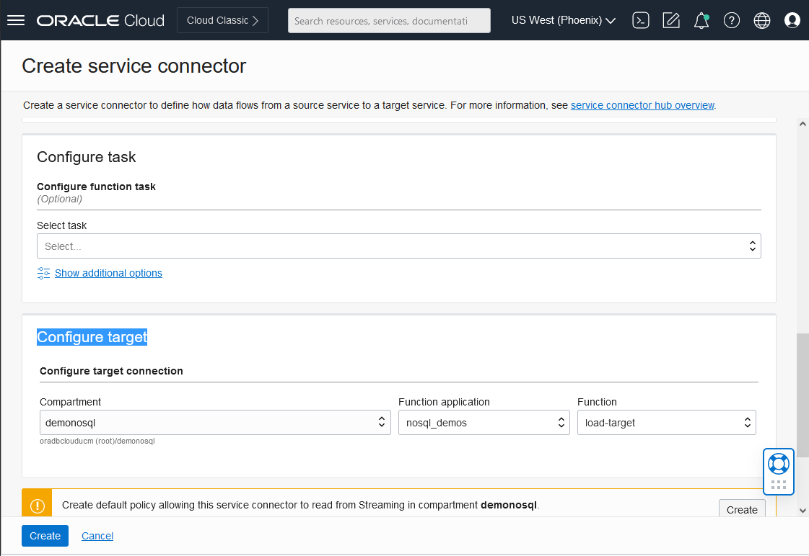

      Create the default policies by clicking in the red buttons

      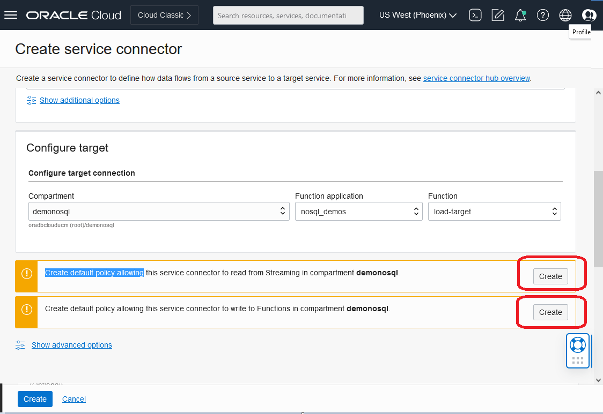

      You will have now

      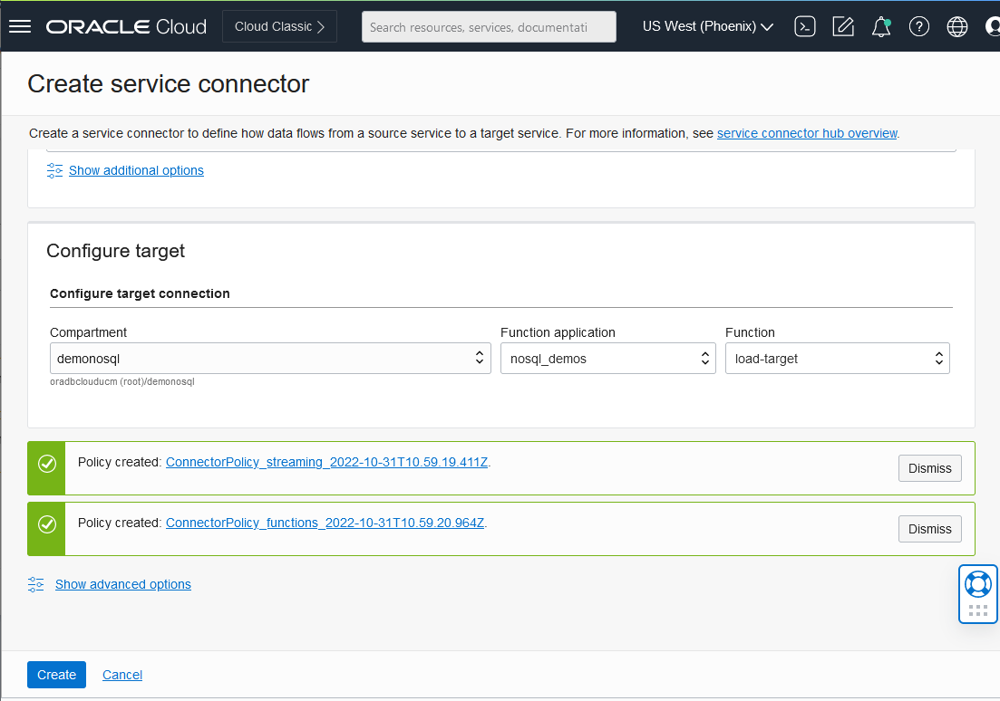

      Click on create button

4. Wait few second until the stream is created - Status will change from **Creating** to **Active**

    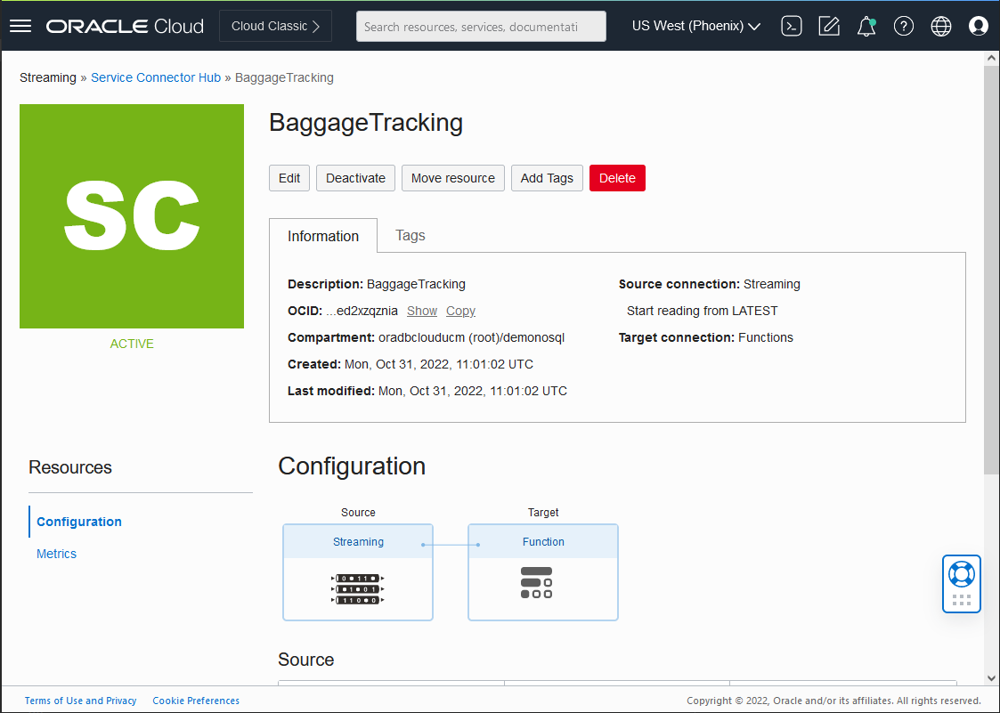


## Task 3: Restart the Cloud Shell

1. Lets get back into the Cloud Shell.  From the previous lab, you may have minimized
it in which case you need to enlarge it.  It is possible it may have become disconnected
and/or timed out.   In that case, restart it.

    

2. Execute the following environment setup shell script in the Cloud Shell to set up your environment.

    ```
    <copy>
    source ~/serverless-with-nosql-database/env.sh
    </copy>
    ```

3. Invoke the function behind to validate.  The first time running this function takes about 1 min because it has to populate the cache. Execute in Cloud Shell.

    ```
    <copy>
    cd ~/serverless-with-nosql-database/functions-fn
    cd streaming/load-target
    var1=`base64 -w 0 ~/BaggageData/baggage_data_file99.json`
    cp test_templ.json stream_baggage_data_file99.json
    sed -i "s/<here>/$var1/g"  stream_baggage_data_file99.json
    </copy>
    ```
    ```
    <copy>
    fn invoke $APP_NAME load-target < stream_baggage_data_file99.json
    </copy>
    ```

## Task 4: Load Data Using Streaming Input

When the configuration finishes, you need to publishing messages to the Stream instance
from the OCI Console (copy/paste the json Baggage document in Data text box.) or using
OCI cli commands in order to simulate real-time traffic.

1. We will simulate real-time traffic.   Execute in Cloud Shell.
    ```
    <copy>
    STREAM_OCID=`oci streaming admin stream list --compartment-id $NOSQL_COMP_ID --name BaggageTracking --lifecycle-state ACTIVE | jq -r '."data"[].id'`
    STREAM_ENDPOINT=`oci streaming admin stream list --compartment-id $NOSQL_COMP_ID --name BaggageTracking --lifecycle-state ACTIVE | jq -r '."data"[]."messages-endpoint"'`
    echo $STREAM_OCID
    echo $STREAM_ENDPOINT
    </copy>
    ```
    ```
    <copy>
    cd ~/serverless-with-nosql-database/functions-fn
    cd streaming/load-target
    for file in `ls -1 ~/BaggageData/baggage_data* | tail -20`; do
      echo $file
      filename=`basename $file`
      var1=`base64 -w 0 $file`
      cp stream_oci_cli_templ.json stream_oci_cli_$filename
      sed -i "s/<here>/$var1/g"  stream_oci_cli_$filename
      oci streaming stream message put --stream-id  $STREAM_OCID \
      --messages file://stream_oci_cli_$filename --endpoint $STREAM_ENDPOINT
      sleep 1
    done
    </copy>
    ```

2. Starting with the demo table, we can go and look at the data we inserted for each of the tables.

    1. On the OCI menu drop down on the left, go to Databases and then hit 'Tables' under Oracle NoSQL Database.  This brings you to the 'Tables' screen

    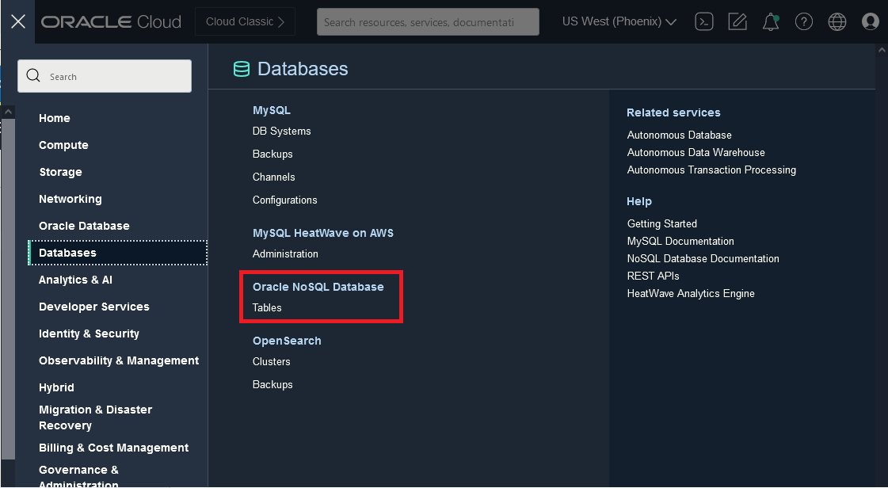

    2. Select the **demo** table

    2. On the left Click on Explore data

        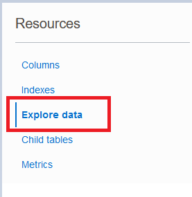

    3. In the textbox Query, keep the text `SELECT * FROM demo`.  This will select all the rows from our table.  Click on execute multiple times

        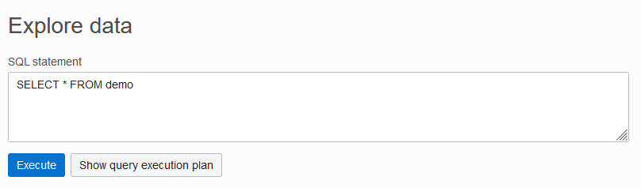

      You will see in the bottom of the screen the row that we are inserting.

    4. In the textbox Query, change the text to `SELECT count(*) FROM demo`.  This will count the rows from our table.  Click on execute multiple times

    4. In the textbox Query, change the text to `DELETE FROM demo`.  This will delete all the rows from our table if you can restart.


## Learn More


* [Oracle NoSQL Database Cloud Service page](https://www.oracle.com/database/nosql-cloud.html)
* [About Oracle NoSQL Database Cloud Service](https://docs.oracle.com/pls/topic/lookup?ctx=cloud&id=CSNSD-GUID-88373C12-018E-4628-B241-2DFCB7B16DE8)
* [About Functions](https://docs.oracle.com/en-us/iaas/Content/Functions/Concepts/functionsoverview.htm)
* [About API Gateway](https://docs.oracle.com/en-us/iaas/Content/APIGateway/home.htm)
* [About Cloud Shell](https://docs.oracle.com/en-us/iaas/Content/API/Concepts/cloudshellintro.htm)


## Acknowledgements
* **Author** - Dario Vega, Product Manager, NoSQL Product Management and Michael Brey, Director, NoSQL Product Development
