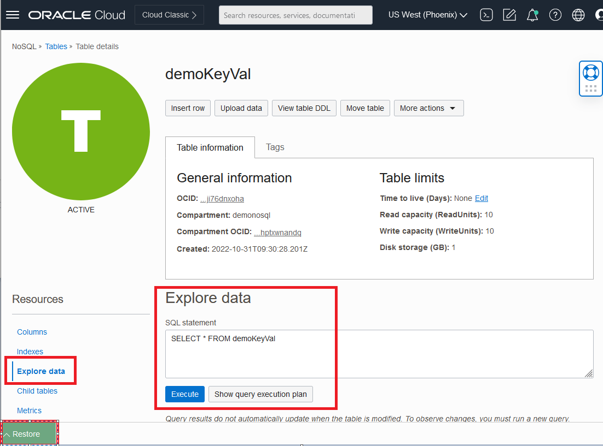

# Explore Data and Run Queries

## Introduction

This lab picks up where lab 3 left off.   We are going to explore in more detail the tables we created, load data with functions, and execute queries a python application.  

Estimated Time: 25 minutes

### Objectives

* Understand the different tables
* Load data with functions
* Read data with REST api
* Read data with a python application

### Prerequisites

* An Oracle Free Tier, Always Free, or Paid Cloud Account
* Connection to the Oracle NoSQL Database Cloud Service
* Working knowledge of bash shell
* Working knowledge of vi, emacs
* Working knowledge of Python


## Task 1: Restart the Cloud Shell

1. Lets get back into the Cloud Shell.  From the previous lab, you may have minimized it in which case you need to enlarge it.  It is possible it may have become disconnected and/or timed out.   In that case, restart it.

    

2. Execute the following environment setup shell script in the Cloud Shell to set up your environment. If you close/open the Cloud Shell Console, please re-execute it.

    ```
    <copy>
    source ~/serverless-with-nosql-database/env.sh
    </copy>
    ```
3. For this LiveLab, we are not deploying the functions using the terraform script. For people wanting to skip this Lab and running the next Labs

    ```
    <copy>
    cd ~/serverless-with-nosql-database/functions-fn
    cd load/demo-keyval-load
    fn -v deploy --app $APP_NAME
    cd ~/serverless-with-nosql-database/functions-fn
    cd load/demo-load
    fn -v deploy --app $APP_NAME
    cd ~/serverless-with-nosql-database/functions-fn
    cd api/demo-api
    fn -v deploy --app $APP_NAME
    cd ~/serverless-with-nosql-database/functions-fn
    cd streaming/load-target
    fn -v deploy --app $APP_NAME
    </copy>
    ```  

## Task 2: Load Data and Examine It

The goal of this task is to understand the difference between the 2 data models used. The demoKeyVal table is a schema-less table, sometimes referred to as a JSON document that contains a primary key and a JSON column.  The demo table contains the primary key, several fixed columns and a JSON column.  Sometimes referred to as a fixed-schema. These tables are logically equivalent. Which data model you use depends on your business model.   Oracle NoSQL Database Cloud Service is extremely flexible in how you can model your data.   It is a true multi-model database service.

  

1. We will use functions that we created in Lab 2 to add rows into the table demoKeyVal.  We will load 5 additional rows.  The initial invocation of functions can take 30-45 seconds because components are getting loaded into your environment.  Execute in Cloud Shell.

    ```
    <copy>
    cd ~/serverless-with-nosql-database/functions-fn
    cd load/demo-keyval-load
    cat ~/BaggageData/baggage_data_file99.json | fn invoke $APP_NAME demo-keyval-load
    cat ~/BaggageData/baggage_data_file9.json  | fn invoke $APP_NAME demo-keyval-load
    cat ~/BaggageData/baggage_data_file103.json  | fn invoke  $APP_NAME demo-keyval-load
    cat ~/BaggageData/baggage_data_file2.json  | fn invoke $APP_NAME demo-keyval-load
    cat ~/BaggageData/baggage_data_file84.json  | fn invoke  $APP_NAME demo-keyval-load
    </copy>
    ```

2. Use the steps in the previous Lab 3 to read the data for the demo-keyval-load table from the OCI console.  

    

3. Next, we will use a function to load the table demo with the same 5 rows.  Execute in Cloud Shell.

    ```
    <copy>
    cd ~/serverless-with-nosql-database/functions-fn
    cd load/demo-load
    cat ~/BaggageData/baggage_data_file99.json | fn invoke  $APP_NAME demo-load
    cat ~/BaggageData/baggage_data_file9.json | fn invoke  $APP_NAME demo-load
    cat ~/BaggageData/baggage_data_file103.json  | fn invoke  $APP_NAME demo-load
    cat ~/BaggageData/baggage_data_file2.json | fn invoke  $APP_NAME demo-load
    cat ~/BaggageData/baggage_data_file84.json  | fn invoke  $APP_NAME demo-load
    </copy>
    ```

4. Use the steps in the previous Lab 3 to read the data for the demo-load table from the OCI console.

    


## Task 3: Read Data Using a Node.js Application

In this Task, we will review the code and trigger the function manually using the `fn invoke` CLI command.

1. Let's look at the function we will be invoking.    By setting up different endpoints, you can cause different operations to happen.   In this node.js function, we have 3 different endpoints setup in advance. Execute in Cloud Shell.

    ```
    <copy>
    cd ~/serverless-with-nosql-database/functions-fn
    cd api/demo-api
    vi func.js
    </copy>
    ```

2. Next, we will call `fn invoke` manually, passing it the getBagInfoByTicketNumber endpoint.   Execute in Cloud Shell one at a time so you can see the results.

    ```
    <copy>
    echo '{"ticketNo":"1762386738153", "endPoint":"getBagInfoByTicketNumber"}' | fn invoke $APP_NAME demo-api | jq
    </copy>
    ```
    ```
    <copy>
    echo '{"endPoint":"getBagInfoByTicketNumber"}' | fn invoke $APP_NAME demo-api | jq
    </copy>
    ```
    ```
    <copy>
    echo '{"endPoint":"getBagInfoByTicketNumber"}' | fn invoke $APP_NAME demo-api | jq '. | length'
    </copy>
    ```

  Each of these produced slightly different results.   The first one display the document with a specific ticket number, the second displayed all the records and the third gave a count of the records.

3. Now, lets test another one of the endpoints in the function. Execute in Cloud Shell.

    ```
    <copy>
    echo '{"endPoint":"getPassengersAffectedByFlight"}' | fn invoke $APP_NAME demo-api | jq
    </copy>
    ```

  As you can see the field "message" the getPassengersAffectedByFlight endpoint is still under construction.  In other words the code for that endpoint has not been completed yet.

4. The result can be simulated by using this call. Execute in Cloud Shell.

    ```
    <copy>
    echo '{"endPoint":"getPassengersAffectedByFlight"}' | fn invoke $APP_NAME demo-api | fn invoke $APP_NAME demo-api | jq
    </copy>
    ```

5. In fact, you can run SQL queries using the endpoint executeSQL.   This endpoint is coded to use the executeQuery(sql) API call. This will grab a sql query that has already been written and stored in your Cloud Shell.   Execute in Cloud Shell.

    ````
    <copy>
    SQL_STATEMENT=$(cat ~/serverless-with-nosql-database/objects/query1.sql | tr '\n' ' ')
    echo "$SQL_STATEMENT"
    </copy>
    ````
    ```
    <copy>

    echo "{\"sql\":\"$SQL_STATEMENT\",\""endPoint\"": \""executeSQL\"" }"  | fn invoke $APP_NAME demo-api
    </copy>
    ````
This displayed the entire record for passenger 'Clemencia Frame' where as the query before just displayed some basic information.

6. Let's say you didnt want to use functions.   You can also execute the same sql statement using OCI CLI commands.  Going this route, you will be querying the data over REST.  Execute in Cloud Shell.

    ````
    <copy>
    oci nosql query execute -c  $COMP_ID --statement "$SQL_STATEMENT"
    </copy>
    ````

  In this case, the data is formatted as a nice JSON document.


## Task 4: Load Data Using Streaming Input

In this task, we are going to load a record using a python function.  This uses the Oracle NoSQL Python SDK which we call Borneo.  We can take a look at the application. At the bottom of the file is the authentication which uses resource principals.

1. Let's look at the file.  Execute in Cloud Shell.

    ```
    <copy>
    cd ~/serverless-with-nosql-database/functions-fn
    cd streaming/load-target
    vi func.py
    </copy>
    ```

2. Run this function.  The first time running this function takes about 1 min because it has to populate the cache. Execute in Cloud Shell.

    ```
    <copy>
    cd ~/serverless-with-nosql-database/functions-fn
    cd streaming/load-target
    var1=`base64 -w 0 ~/BaggageData/baggage_data_file99.json`
    cp test_templ.json stream_baggage_data_file99.json
    sed -i "s/<here>/$var1/g"  stream_baggage_data_file99.json
    </copy>
    ```
    ```
    <copy>
    fn invoke $APP_NAME load-target < stream_baggage_data_file99.json
    </copy>
    ```

## Task 5: Read Data Using a Python CLI Application

1. Create the python CLI application in the Cloud shell.  Execute in Cloud Shell.

    ```
    <copy>
    cd ~/serverless-with-nosql-database/
    source ~/serverless-with-nosql-database/env.sh
    pip3 install borneo --user
    pip3 install cmd2  --user

    </copy>
    ```
    ```
    <copy>
    python3 nosql.py -s cloud -t $OCI_TENANCY -u $NOSQL_USER_ID -f $NOSQL_FINGERPRINT -k ~/NoSQLLabPrivateKey.pem -e https://nosql.${OCI_REGION}.oci.oraclecloud.com
    </copy>
    ```
2.  This will create a Pyhton NoSQL shell that you can execute queries in.

   

   3. Load additional data so we can run some queries. Execute in Cloud Shell.

       ````
       <copy>
       load ../BaggageData/load_multi_line.json demo
       </copy>
       ````

   4. Execute the following queries. Execute in Cloud Shell.

       ````
       <copy>
       SELECT count(*) FROM demo d;
       </copy>
       ````
       This counts all the records in the table.

       ````
       <copy>
       SELECT *
       FROM demo d
       WHERE d.bagInfo.flightLegs.flightNo =ANY 'BM254';
       </copy>
       ````
       This will grab all records where a bag was on flight BM254.

       ````
       <copy>
       SELECT d.fullName, d.contactPhone, d.ticketNo , d.bagInfo.flightLegs.flightNo as bagInfo
       FROM demo d
       WHERE d.bagInfo.flightLegs.flightNo =ANY 'BM866';
       </copy>
       ````
       This will grab basic information for bags on flight BM866. We are also renaming a field in the output.

       ````
       <copy>
       SELECT d.fullName, d.contactPhone, d.ticketNo , d.bagInfo.flightLegs.flightNo as bagInfo
       FROM demo d
       WHERE d.bagInfo.flightLegs.flightNo =ANY "BM715"
       AND d.bagInfo.flightLegs.flightNo =ANY "BM204";
       </copy>
       ````
       This will grab basic information on bags that were on flight BM715 and BM204.

       ````
       <copy>
       SELECT d.fullName, d.contactPhone, d.ticketNo , d.bagInfo.flightLegs.flightNo as bagInfo
       FROM   demo d
       WHERE  d.bagInfo.flightLegs.flightNo =ANY "BM604"
       AND    d.bagInfo.flightLegs.flightNo =ANY "BM667"
       AND    size(d.bagInfo.flightLegs) = 2;
       </copy>
       ````
       This will grab basic information on bags that were on flight BM604 and BM667 and the total journey was 2 legs.

   5. Write new queries to answer the following questions. This should give an appreciation of the types of queries that can be written against Oracle NoSQL Database Cloud Service.

    - Retrieve the names and phone numbers for passengers that had a bag with any action on any flight leg that occurred at the Sydney Airport(SYD). **Hint:** Every record has an actions array at: bagInfo.flightLegs.actions

    - Find the number of bags on flight BM715. **Hint:** The size of the bagInfo array represents the number of bags a passenger has checked.

    - Find the names of passengers that had their bags initially loaded in Chicago. **Hint:** Chicago Airport(ORD).

     **Note:** The Learn More contains a link to the SQL Reference Guide. Lab 3, Task 3 contains an example of the JSON record to look at.

   6. Type in **exit** to exit from the Python application.

   7. Minimize the Cloud Shell by pressing the **minimize** key.


## Learn More


* [Oracle NoSQL Database Cloud Service page](https://www.oracle.com/database/nosql-cloud.html)
* [About Oracle NoSQL Database Cloud Service](https://docs.oracle.com/pls/topic/lookup?ctx=cloud&id=CSNSD-GUID-88373C12-018E-4628-B241-2DFCB7B16DE8)
* [Java API Reference Guide](https://docs.oracle.com/en/cloud/paas/nosql-cloud/csnjv/index.html)
* [Node API Reference Guide](https://oracle.github.io/nosql-node-sdk/)
* [Python API Reference Guide](https://nosql-python-sdk.readthedocs.io/en/latest/index.html)
* [About Functions](https://docs.oracle.com/en-us/iaas/Content/Functions/Concepts/functionsoverview.htm)
* [About Cloud Shell](https://docs.oracle.com/en-us/iaas/Content/API/Concepts/cloudshellintro.htm)


## Acknowledgements
* **Author** - Dario Vega, Product Manager, NoSQL Product Management and Michael Brey, Director, NoSQL Product Development
* **Last Updated By/Date** - Dario Vega, NoSQL Product Management, NoSQL Product Development, September 2022
