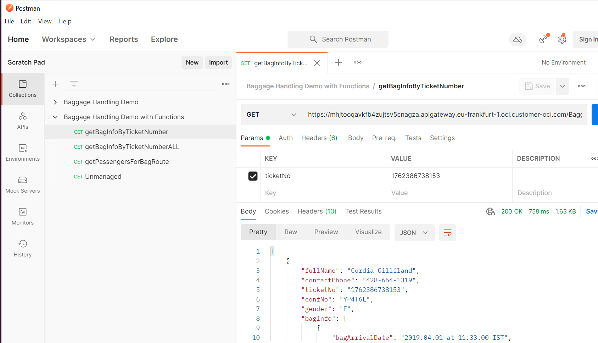
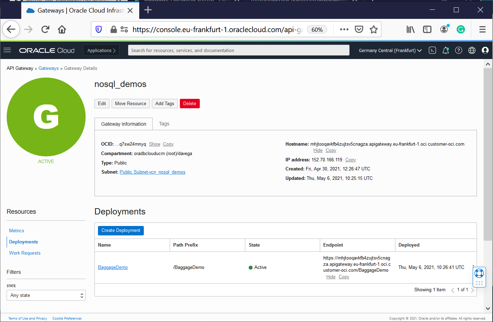
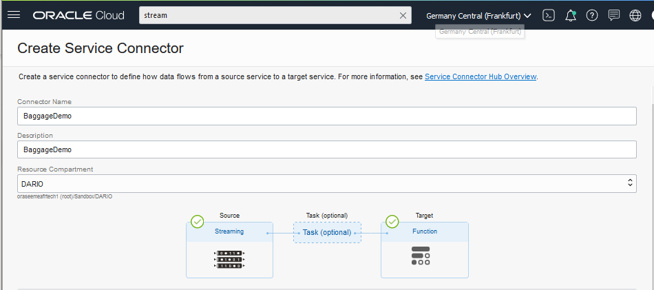
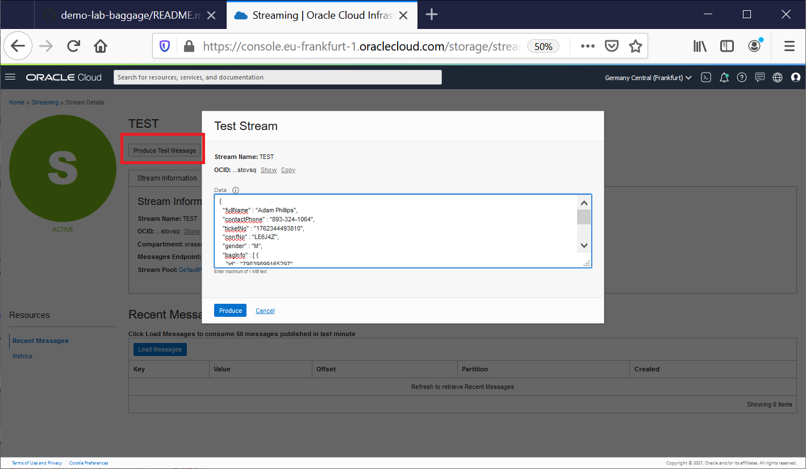
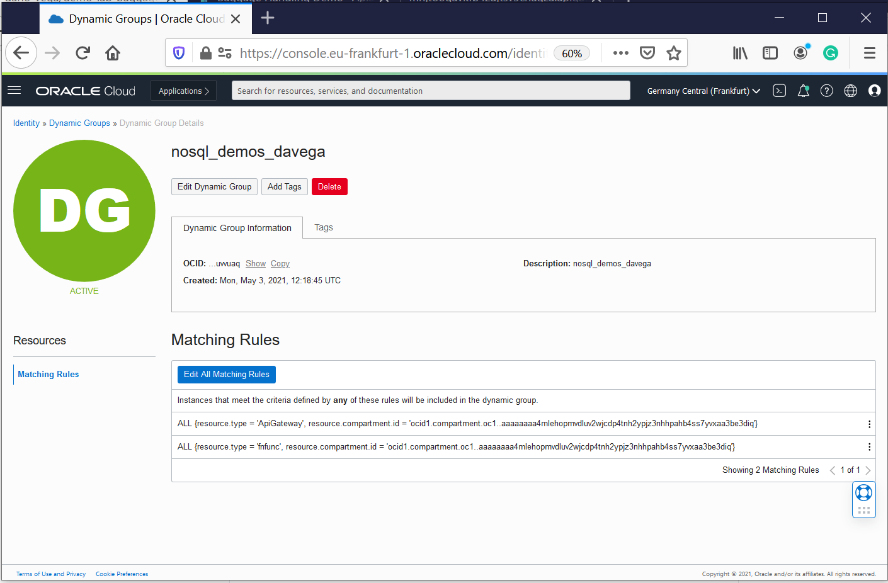
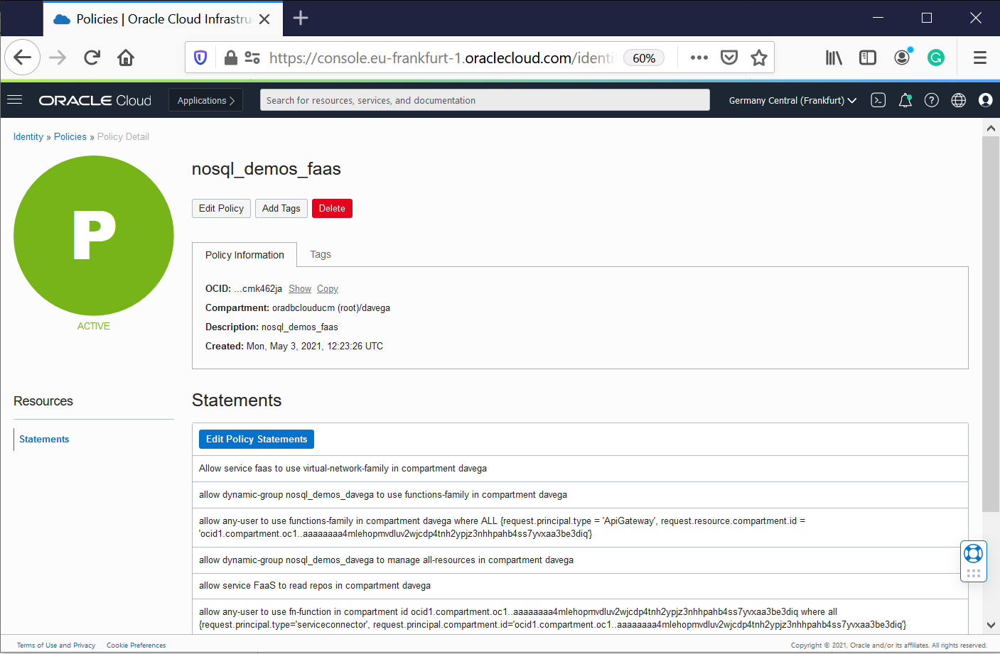
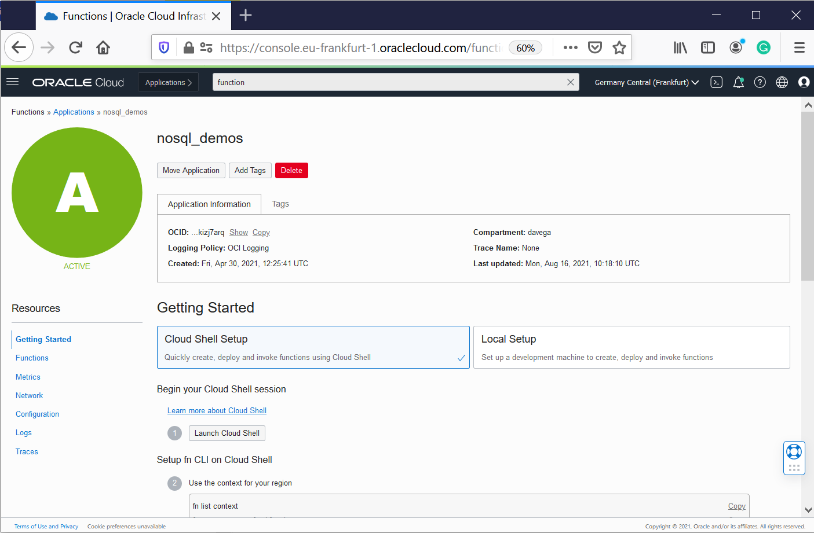

# demo-lab-baggage 

The multi-tier application has been the most used architecture pattern for decades. The multi-tier pattern provides good guidelines for 
you to follow to ensure decoupled and scalable application components that can be separately managed and maintained. 

For introductory information about this demo, [read the following blog](https://blogs.oracle.com/nosql)

## The Serverless Logic Tier
The logic tier of the three-tier architecture represents the brains of the application. Integrating these components: an API Gateway, Streams, and Functions; 
in your logic tier can be revolutionary.  The features of these services allow you to build a serverless production application that is highly available, 
scalable, and secure. Your application can use thousands of servers, however, by leveraging this pattern you do not have to manage even a single one. 

In addition, by using these managed services together you gain the following benefits: 
*	No operating systems to choose, secure, patch, or manage.
*	No servers to size, monitor, or scale out. 
*	No risk to your cost by over-provisioning. 
*	No risk to your performance by under-provisioning.

**Learn and Discover why NoSQL Cloud Services and OCI native services are compelling**


## DEMO-API-Gateway

A common requirement is to build an API with serverless functions on the backend, and an API gateway providing front-end access to those functions. 
This is the scenario that we want to illustrate. We created a [demo-api function](./functions-fn/api/demo-api/func.js) which reads data from a NoSQL 
table, implementing part of the logic tier.

The API Gateway service enables you to publish APIs with private endpoints that are accessible from within your network, or exposed with public IP addresses 
if you want them to accept internet traffic. The endpoints support API validation, request and response transformation, CORS, 
authentication and authorization, and request limiting.  You can access the API Gateway service to define API gateways and API deployments using the 
OCI Console and the REST API. 

Oracle Functions enables you to create serverless functions that are built as Docker images and pushed to a specified Docker registry.  
You can add Oracle Functions to an API deployment specification by using the Console. You can also do this by using a JSON file.

When the configuration is finished, you can test the endpoints to retrieve Data using your favorite API Browser:



Or use your standard WEB Browser to test the endpoints to retrieve Data as we did using PostMan
- https://mhjtooqavkfb4zujtsv5cnagza.apigateway.eu-frankfurt-1.oci.customer-oci.com/BaggageDemo/getBagInfoByTicketNumber
- https://mhjtooqavkfb4zujtsv5cnagza.apigateway.eu-frankfurt-1.oci.customer-oci.com/BaggageDemo/getBagInfoByTicketNumber?ticketNo=1762386738153

Or simulate traffic using API calls from a linux system:

````
IFS=$'\n'
unset ticketNo
COMP_ID=`oci iam compartment list --name  demonosql | jq -r '."data"[].id'`
HOSTAPI=`oci api-gateway gateway list --compartment-id $COMP_ID --lifecycle-state ACTIVE --display-name nosql_demos | jq -r '."data".items[]."hostname"'`
URL="https://$HOSTAPI/BaggageDemo/getBagInfoByTicketNumber"
echo $HOSTAPI
echo $URL
# URL="https://mhjtooqavkfb4zujtsv5cnagza.apigateway.eu-frankfurt-1.oci.customer-oci.com/BaggageDemo/getBagInfoByTicketNumber"

ticketNo=($(curl ${URL} | jq -r '[.[].ticketNo] | .[]?'	))
for (( i=0; i<${#ticketNo[@]}; i++ )); do
   curl -X GET -k -d '{"name":"${ticketNo[i]}"}' "${URL}?ticketNo=${ticketNo[i]}" 2>/dev/null | jq
   sleep 3
done
````

Instead of using the generated endpoint, you can specify a particular custom domain name for an API gateway. The API gateways you create with
the API Gateway service are TLS-enabled, and therefore require TLS certificates (formerly SSL certificates) issued by a Certificate Authority to 
secure them. To specify a particular custom domain name for an API gateway, you must obtain a custom TLS certificate from a Certificate Authority, 
rather than have the API Gateway service obtain a TLS certificate for you.




Finally, [Apiary](https://apiary.io/) provides you with the ability to design APIs using either API Blueprint or Swagger. From these description files, 
Oracle Apiary generates interactive documentation and a console for making calls to the APIs from the UI. Apiary interactive documentation is an interactive 
representation of your API Description for you to not only read and write, but to be a place which allows you to completely interact with your API 
—even before you’ve built it. 

Apiary was used in our project as a very powerful tool for **Collaboration and Interactions**.

https://foo179.docs.apiary.io/#


## DEMO-Service-Connector

Service Connector Hub is a cloud message bus platform that offers a single pane of glass for describing, executing, and monitoring movement of data 
between services in Oracle Cloud Infrastructure. 

Service Connector Hub orchestrates data movement between services in the Oracle Cloud Infrastructure. 

This scenario involves creating the [load-target](./functions-fn/streaming/load-target/func.py ) function and then referencing that function 
in a service connector (Service Connector Hub)  to process and move baggage data from the "Streaming" source to a NoSQL table.



When the configuration finishes, you need to publishing messages to the Stream instance from the OCI Console (copy/paste the json Baggage document in Data text box.). 



Or using OCI cli commands in order to simulate real-time traffic.

````
cd ~/demo-lab-baggage/functions-fn
cd streaming/load-target
COMP_ID=`oci iam compartment list --name  demonosql | jq -r '."data"[].id'`
STREAM_OCID=`oci streaming admin stream list --compartment-id $COMP_ID --name nosql_demos --lifecycle-state ACTIVE | jq -r '."data"[].id'`
STREAM_ENDPOINT=`oci streaming admin stream list --compartment-id $COMP_ID --name nosql_demos --lifecycle-state ACTIVE | jq -r '."data"[]."messages-endpoint"'`
echo $COMP_ID
echo $STREAM_OCID
echo $STREAM_ENDPOINT

for file in `ls -1 ~/BaggageData/baggage_data* | tail -20`; do
  echo $file
  filename=`basename $file` 
  var1=`base64 -w 0 $file`
  cp stream_oci_cli_templ.json stream_oci_cli_$filename
  sed -i "s/<here>/$var1/g"  stream_oci_cli_$filename
  oci streaming stream message put --stream-id  $STREAM_OCID \
  --messages file://stream_oci_cli_$filename --endpoint $STREAM_ENDPOINT
  sleep 5
done
````
  

## DEMO NoSQL and Functions

Oracle NoSQL Database Cloud Service (NDCS) is a fully managed database cloud service that is designed for database operations that require predictable, 
single digit millisecond latency responses to simple queries. NDCS allows developers to focus on application development rather than setting up cluster 
servers, or performing system monitoring, tuning, diagnosing, and scaling. 

Once you are authenticated with your Oracle Cloud account, you can create a NoSQL table, and specify the throughput and storage requirements for the table. 
Oracle reserves and manages the resources to meet your requirements, and provisions capacity for you. Capacity is specified using read and write units for 
throughput and GB for storage units.

As a developer, you can connect to NDCS and work with NoSQL tables using the NoSQL SDKs available in multiple languages.

**In this demo, we will use NoSQL Database Python SDK and NoSQL Database Node.js SDK in conjunction with Oracle Functions.**

We briefly touched on Oracle Functions, additionally, it is a fully managed, multi-tenant, highly scalable, on-demand, Functions-as-a-Service (FaaS) platform. It is 
built on enterprise-grade Oracle Cloud Infrastructure and powered by the Fn Project open source engine. Use Oracle Functions (sometimes abbreviated to just Functions) 
when you want to focus on writing code to meet business needs. 

To enable a function to access another Oracle Cloud Infrastructure resource, you have to include the function in a dynamic group, and then create a policy to grant the
dynamic group access to that resource. 

Having set up the policy and the dynamic group, you can then include a call to a 'resource principal provider' in your function code. The resource principal 
provider uses a resource provider session token (RPST) that enables the function to authenticate itself with other Oracle Cloud Infrastructure services. The token 
is only valid for the resources to which the dynamic group has been granted access. 

**Dynamic groups** allow you to group Oracle Cloud Infrastructure compute instances as "principal" actors (similar to user groups). You can then create policies to 
permit instances to make API calls against Oracle Cloud Infrastructure services. When you create a dynamic group, rather than adding members explicitly to the group, 
you instead define a set of matching rules to define the group members

```
ALL {resource.type = 'ApiGateway', resource.compartment.id = 'ocid1.compartment.oc1..aaaaaaaafml3tca3zcxyifmdff3aadp5uojimgx3cdnirgup6rhptxwnandq'}
ALL {resource.type = 'fnfunc', resource.compartment.id = 'ocid1.compartment.oc1..aaaaaaaafml3tca3zcxyifmdff3aadp5uojimgx3cdnirgup6rhptxwnandq'}
```
NOTE: "_ocid1.compartment.oc1..aaaaaaaafml3tca3zcxyifmdff3aadp5uojimgx3cdnirgup6rhptxwnandq_" is the OCID for my test compartment.



**Oracle NoSQL Database Cloud Service uses Oracle Cloud Infrastructure Identity and Access Management to provide secure access to Oracle Cloud.** Oracle Cloud 
Infrastructure Identity and Access Management enables you to create user accounts and give users permission to inspect, read, use, or manage tables. 

For demo purpose, I am providing all rights to the Dynamic Group created in my compartment.
```
allow dynamic-group nosql-demos_davega to manage all-resources in compartment davega
```


You can find more information about NoSQL Privileges in the documentation- [Policy Reference](https://docs.oracle.com/en/cloud/paas/nosql-cloud/csnsd/policy-reference.html#GUID-C194529F-2B38-4BDE-9777-2D3C0CF248D3).


After doing the setup, you just use **Resource Principals to do the connection to NoSQL Cloud Service** as shown below.

In this snippet, there are hard-coded references (eg REGION). This is not the case in the final code (read takeaways in this section)

**NoSQL Database Node.js SDK**
```
function createClientResource() {
  return  new NoSQLClient({
    region: Region.EU_FRANKFURT_1,
    compartment:'ocid1.compartment.oc1..aaaaaaaafml3tca3zcxyifmdff3aadp5uojimgx3cdnirgup6rhptxwnandq',
    auth: {
        iam: {
            useResourcePrincipal: true
        }
    }
  });
}
```
**NoSQL Database Python SDK**
```
def get_handle():
     provider = borneo.iam.SignatureProvider.create_with_resource_principal()
     config = borneo.NoSQLHandleConfig('eu-frankfurt-1', provider).set_logger(None)
     return borneo.NoSQLHandle(config)
```

**Takeaway**: Read ["best practice"](./functions-fn/README.md) when calling Oracle NoSQL Database Cloud Service from Functions


## demo-lab-baggage-deployment-steps
1. Create a compartment - demonosql 
2. Create an API Key and Auth Token for your user
3. Create the dynamic group and the policies (guidelines are provided in  [./privs/dynamic-group](./privs/dynamic-group) directory
4. Create a VCN with Internet Connectivity (VCN Wizard) - vcn_nosql_demos
5. Allows TCP traffic for ports: 443 HTTPS 
6. Create the NoSQL Tables - ci-below
7. Create the Function Application - nosql_demos
8. Configure Cloud Shell (follow the Instructions in the OCI Console - Getting Started for this application)
9. Deploy and test the functions in this github repository - ci-below
10. Create the Stream - nosql_demos
11. Create and configure the Service Connector - nosql_demos
12. Create and configure the API Gateway - nosql_demos - /BaggageDemo/{api}
13. Update the policies with the good STREAM ocid- if needed
14. Execute the API and Streaming tests provided ci-above

More detailed information in this file [Instructions.md](./Instructions.md) 

You can also use the terraform scripts provided. It will execute steps 4-12 and create the applicationt for you.

[](https://cloud.oracle.com/resourcemanager/stacks/create?region=home&zipUrl=https://github.com/dario-vega/demo-lab-baggage/archive/refs/heads/main.zip) - home region


[](https://cloud.oracle.com/resourcemanager/stacks/create?region=eu-frankfurt-1&zipUrl=https://github.com/dario-vega/demo-lab-baggage/archive/refs/heads/main.zip) - eu-frankfurt-1


### IaC - NoSQL Tables Deployment

Creating NoSQL tables using oci-cli - DDL for create tables in this [directory](./objects) (e.g demo.nosql)
```
cd ~/demo-lab-baggage/objects
COMP_ID=`oci iam compartment list --name  demonosql | jq -r '."data"[].id'`
echo $COMP_ID
DDL_TABLE=$(cat demo.nosql)
echo $DDL_TABLE

oci nosql table create --compartment-id "$COMP_ID"   \
--name demo --ddl-statement "$DDL_TABLE" \
--table-limits="{\"maxReadUnits\": 15,  \"maxStorageInGBs\": 1,  \"maxWriteUnits\": 15 }"

DDL_TABLE=$(cat demoKeyVal.nosql)
echo $DDL_TABLE

oci nosql table create --compartment-id "$COMP_ID"   \
--name demoKeyVal  --ddl-statement "$DDL_TABLE" \
--table-limits="{\"maxReadUnits\": 15,  \"maxStorageInGBs\": 1,  \"maxWriteUnits\": 15 }"

```

Creating NoSQL tables Using Terraform - use the [demo-nosql-lab-baggage-terraform.zip](./demo-nosql-lab-baggage-terraform.zip) provided.

```
## This configuration was generated by terraform-provider-oci

resource oci_nosql_table export_demoKeyVal {
  compartment_id = var.compartment_ocid
  ddl_statement  = "CREATE TABLE IF NOT EXISTS demoKeyVal ( key INTEGER GENERATED ALWAYS AS IDENTITY (START WITH 1 INCREMENT BY 1 NO CYCLE ), value JSON, PRIMARY KEY (key))"
  defined_tags = {
  }
  freeform_tags = {
  }
  is_auto_reclaimable = "false"
  name                = "demoKeyVal"
  table_limits {
    max_read_units     = "10"
    max_storage_in_gbs = "1"
    max_write_units    = "10"
  }
}


resource oci_nosql_table export_demo {
  compartment_id = var.compartment_ocid
  ddl_statement  = "CREATE TABLE if not exists demo(\n  fullName     STRING,\n  contactPhone STRING,\n  ticketNo     STRING,\n  confNo       STRING,\n  gender       STRING,\n  bagInfo      JSON,\n PRIMARY KEY ( ticketNo )\n )"
  defined_tags = {
  }
  freeform_tags = {
  }
  is_auto_reclaimable = "false"
  name                = "demo"
  table_limits {
    max_read_units     = "10"
    max_storage_in_gbs = "1"
    max_write_units    = "10"
  }
}

```


### Data for test

https://github.com/dario-vega/ndcs_baggage_tracking_demo

### CI/CD - Functions Manual Deployment

Creating, testing and deploying Functions provided in this demo.


```
COMP_ID=`oci iam compartment list --name  demonosql | jq -r '."data"[].id'`
echo $COMP_ID
export APP_NAME="nosql_demos"
fn config app $APP_NAME NOSQL_COMPARTMENT_ID $COMP_ID
fn config app $APP_NAME NOSQL_REGION 'eu-frankfurt-1'

git clone https://github.com/dario-vega/demo-lab-baggage

cd ~/demo-lab-baggage/functions-fn
cd load/demo-keyval-load
fn -v deploy --app $APP_NAME
cat ~/BaggageData/baggage_data_file99.json | fn invoke $APP_NAME demo-keyval-load
#fn delete function $APP_NAME demo-keyval-load

cd ~/demo-lab-baggage/functions-fn
cd load/demo-load
fn -v deploy --app $APP_NAME
cat ~/BaggageData/baggage_data_file99.json | fn invoke  $APP_NAME demo-load
cat ~/BaggageData/baggage_data_file103.json  | fn invoke  $APP_NAME demo-load
#fn delete function $APP_NAME demo-load

cd ~/demo-lab-baggage/functions-fn
cd api/demo-api

fn -v deploy --app $APP_NAME
echo '{"ticketNo":"1762386738153", "endPoint":"getBagInfoByTicketNumber"}' | fn invoke $APP_NAME demo-api | jq
echo '{"endPoint":"getBagInfoByTicketNumber"}' | fn invoke $APP_NAME demo-api | jq
echo '{"endPoint":"getBagInfoByTicketNumber"}' | fn invoke $APP_NAME demo-api | jq '. | length'
echo '{"endPoint":"getPassengersAffectedByFlight"}' | fn invoke $APP_NAME demo-api | jq
echo '{"endPoint":"demo-api"}' | fn invoke $APP_NAME demo-api | jq
fn invoke $APP_NAME demo-api | jq
#fn delete function $APP_NAME demo-api

cd ~/demo-lab-baggage/functions-fn
cd streaming/load-target

fn -v deploy --app $APP_NAME

var1=`base64 -w 0 ~/BaggageData/baggage_data_file99.json`
cp test_templ.json stream_baggage_data_file99.json
sed -i "s/<here>/$var1/g"  stream_baggage_data_file99.json

fn invoke $APP_NAME load-target < stream_baggage_data_file99.json
#fn delete function $APP_NAME load-target

```

In order to configure your LOCAL test system, you need to follow the instructions in the OCI Console - Getting Started (see screenshot below).



