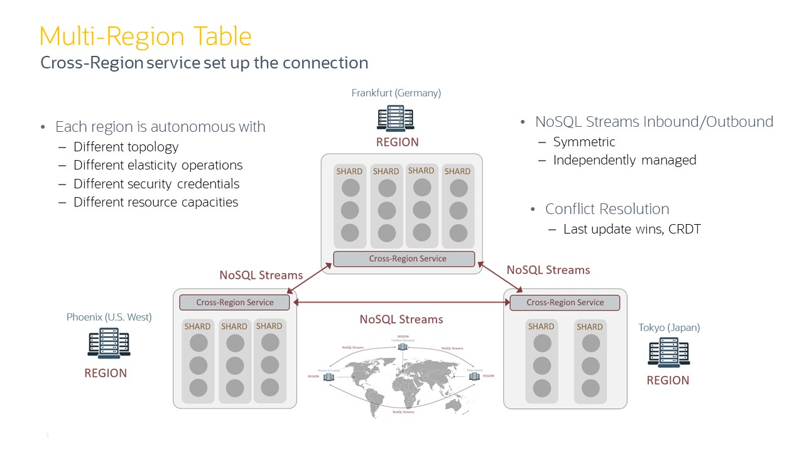

# Creating a geographically distributed Oracle NoSQL database 

This is an advanced topic, and we recommend understanding basic deployments before running through this workshop.  Please read the following blog if you 
want to have more detailed information about [Multi-Region Table.](https://blogs.oracle.com/nosql/oracle-nosql-database-multi-region-table-part1-v2)

In this workshop, 
* we will create 2 NoSQL stores with different names (OUGFR, OUGCO) 
* we will create a minimal store with 1 server, read through [scenario 1](./scenario-1.md) to gain a better understanding of a single node deployment
* we will create 2 regions FR and CO (hardcoded values)
* templates provided in this section also have hardcoded values

It is common to deploy the NoSQL store in each region with a different store name, but it is not mandatory, you can use the same name.

Review our first [workshop](./README.md) for detailed information on deploying different types of NoSQL clusters.

The backbone of multi-region tables is NoSQL streams.  NoSQL streams allows for changes from one database table to be pushed to another database table.  
The cross-region service (xregion service) runs locally in each region and coordinates the sending/receiving of records.  The diagram below shows what 
this looks like.  Each region is autonomous in terms of topology and other layout characteristics.        

 

## Deploy your clusters

In each region in the multi-region NoSQL database setup, you must deploy its own NoSQL store independently.

Before executing, please modify the env.sh and provide **KVSTORE** names for your region. 
1. In the first cluster `KVSTORE=OUGFR`
2. In the second cluster `KVSTORE=OUGCO`

1st cluster - `node1-nosql` | 2nd cluster - `node2-nosql`
---|---|
`cd $HOME/examples-nosql-cluster-deployment/script`|`cd $HOME/examples-nosql-cluster-deployment/script`|
`edit env.sh` change the following line `export KVSTORE=OUGFR` | `edit env.sh` change the following line export `KVSTORE=OUGCO` |
`source env.sh`|`source env.sh`|
`bash stop.sh`|`bash stop.sh`|
`bash clean.sh`|`bash clean.sh`|
`bash boot.sh`|`bash boot.sh`|
`cp template_config1x1.kvs ${KVSTORE}_config1x1.kvs` |`cp template_config1x1.kvs ${KVSTORE}_config1x1.kvs` |
`sed -i "s/<HERE>/$KVSTORE/g" ${KVSTORE}_config1x1.kvs` | `sed -i "s/<HERE>/$KVSTORE/g" ${KVSTORE}_config1x1.kvs` |
`sed -i "s/<KVNODE_1>/$KVHOST/g" ${KVSTORE}_config1x1.kvs` | `sed -i "s/<KVNODE_1>/$KVHOST/g" ${KVSTORE}_config1x1.kvs` |
`kv_admin load -file ${KVSTORE}_config1x1.kvs`|

1st cluster - `node1-nosql` | 2nd cluster - `node2-nosql`
---|---|
`kv_proxy &`|`kv_proxy &`|


## Set up Multi-Region Environment

After building the 2 clusters

1. Configure and start XRegion Service in each region

1st cluster - `node1-nosql` | 2nd cluster - `node2-nosql`
---|---|
`cp ${KVSTORE}_template.json $KVXRS/json.config`|`cp ${KVSTORE}_template.json $KVXRS/json.config`
`nohup java -Xms256m -Xmx2048m -jar $KVHOME/lib/kvstore.jar xrstart -config $KVXRS/json.config  > $KVXRS/nohup.out &` | `nohup java -Xms256m -Xmx2048m -jar $KVHOME/lib/kvstore.jar xrstart -config $KVXRS/json.config  > $KVXRS/nohup.out &` |
`sleep 5`|`sleep 5`

2. Set local Region Name and Create Remote Regions by executing the following command in each cluster

1st cluster - `node1-nosql` | 2nd cluster - `node2-nosql`
---|---|
`kv_admin load -file ${KVSTORE}.kvs`| `kv_admin load -file ${KVSTORE}.kvs`|


## Create Multi-Region Tables

You must create an MR Table on each KVStore in the connected graph and specify the list of regions that the table should span. For this first example, you must create the users table as an **MR Table at both the regions**, in any order. 

````
CREATE TABLE Users(uid INTEGER, person JSON,PRIMARY KEY(uid))  IN REGIONS CO , FR;
````

After creating the MR Table, you can perform read or write operations on the table using the existing data access APIs or DML statements. There is no change to any existing
data access APIs or DML statements to work with the MR Tables. Perform DML operations on the users table in one region, and verify if the changes are replicated to the
other region. 

````
insert into users values(1,{"firstName":"jack","lastName":"ma","location":"FR"});
insert into users values(2, {"firstName":"foo","lastName":"bar","location":null});
update users u set u.person.location = "FR" where uid = 2;
update users u set u.person.location= "CO" where uid =1;
select * from users;
````

[In this blog](https://blogs.oracle.com/nosql/nosql-crdt), we discussed how vital conflict detection and resolution is in an active-active replication.
-    Oracle NoSQL Multi-Region solution enabling predictable low latency and response time from anywhere in the world.
-    Oracle continues to improve the developer experience by introducing CRDTs that perform automatic merging and bookkeeping of value update across regions, alleviating the pain of multi-region reconciliation from your app development experience.

A Multi-Region table is a global logical table that eliminates the problematic and error-prone work of replicating data between regions, enabling developers to focus on application business logic.

Now it is time to test this New Concept: **conflict-free replicated data type**. Scripts are available [here.](https://github.com/dario-vega/crdt-blog-nosql)


# Backup/Restore using Migrator Tool
The instructions below specify a manual procedure for creating a backup of a multi-region table and a procedure for restoring that table in the event of table level data loss or corruption. 

**NOTE** This example is provided for educational purposes only.

The [migrator-export-users.json](./script/migrator-export-users.json) and [migrator-import-users.json](./script/migrator-import-users.json) show an example of scripts used to export/import data in a MR table configuration. In this case, we are exporting in a region, and we decided to do the import in the other region.

````
~/nosql-migrator-1.4.0/runMigrator --config migrator-export-users.json
````
````
~/nosql-migrator-1.4.0/runMigrator --config migrator-import-users.json
````
Use the multi-region statistics to find the most up to date region for the table that you wish to back up. Use the command `show mrtable-agent-statistics -agent 0 -json` to find the region that shows the smallest laggingMS value for the “max” attribute.  This region will contain the most up-to-date version of your table.

The shell script [mrtable-agent-stat.sh](./script/mrtable-agent-stat.sh) can  help you to compare the smallest laggingMS
````
sh mrtable-agent-stat.sh
````
To restore a multi-region table from an export, it is recommended that you stop all write activity to the multi-region table being restored.

**NOTE** The best is recreating the table in all regions before do the import.

And DO NOT FORGET to backup on remote storage (storage that is not local to a NoSQL storage node in the NoSQL topology).

