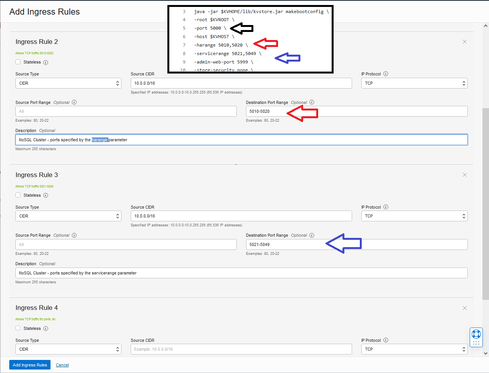
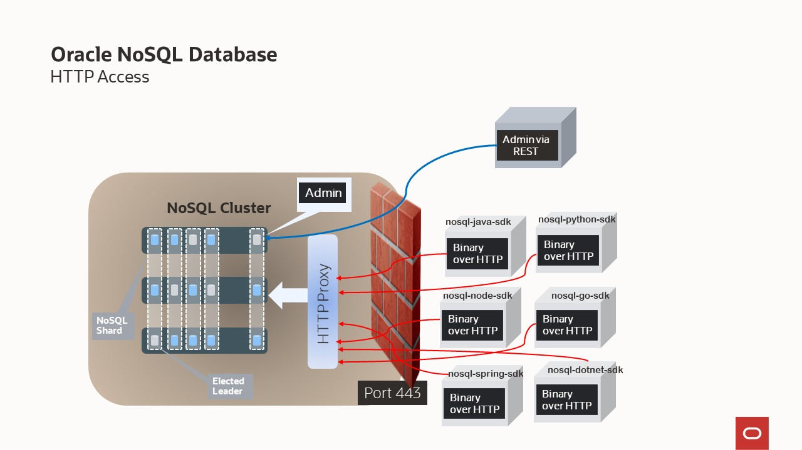

# Example Oracle NoSQL Cluster Deployments


**Oracle NoSQL Database** is designed for today’s most demanding applications that
require low latency responses, flexible data models, and elastic scaling for dynamic workloads.
It supports JSON, Table and Key-Value datatypes running on-premises, or as a cloud
service with on-demand throughput and storage-based provisioning.

This repository provides you guidelines and examples allowing you to learn how to deploy a NoSQL cluster/NoSQL store (also referred to as the topology). 
We will learn how to deploy the most popular topologies:
- single node
- multi node in only one zone
- multi node in multiple primary zones without affinity
- multi node in multiple primary zones with affinity
- multi node in multiple zones (2 primary) + arbiters
- multi node in multiple zones (2 primary/1 secondary) + arbiters
- multi node in multiple zones (1 primary/2 secondary) + arbiters
- multi region deployment

And how to modify an existing configuration
- Increase availability - modify the replication factor
- Elastic Expansion and Rebalancing - scale up/down - scale in/out

There are 2 ways to configure a NoSQL cluster, one using a **secure** configuration and another one using a **non-secure** configuration. 
The primary difference is in the way access is performed to NoSQL store. We recommend using the secure setup, albeit additional steps are needed during set up. 

It is possible to configure and use external certificates to secure an Oracle NoSQL cluster. We will provide details on it in the section **Other topics to explore**.
In the examples in this repository, we will use the default configuration, which uses a self-signed certificate.

The code in this repository was used in **Getting started with an Oracle NoSQL** workshops showcased in NoSQL events around the world.

To learn more about the **Oracle NoSQL Concepts**, we recommend reading this [documentation.](https://docs.oracle.com/en/database/other-databases/nosql-database/24.1/concepts/index.html)

For those of you that prefer a fully serverless managed service - learn more **Oracle NoSQL Database Cloud Service** [here.](https://www.oracle.com/database/nosql/)

## Quick prototyping with Oracle NoSQL Database

If you are looking for quick prototyping, we recommend downloading the following [script in GitHub](https://github.com/oracle/nosql-examples/tree/master/cluster_setup).
This script lets a user set up a small cluster (1-10 machines) quickly, for use in proof-of-concepts, small on-premises installations, and cluster installations
on Public Clouds (OCI, AWS, Azure). It's easy to BYOL to the cloud environment of your choosing.

The `cluster_setup.sh` script is:
1. fast and simple. It sets up a topology with only one zone and if needed, arbiters
2. great for prototyping/proof-of-concepts
3. a canned script, so you do not get a sense for all the steps involved 
4. requires coding knowledge to customize

Read this [whitepaper](https://www.oracle.com/docs/tech/database/oracle-nosql-cluster-setup-oci.pdf) which explains how to install Oracle NoSQL Database on the Oracle Cloud Infrastructure (OCI) using this script.

Instead of the cluster_setup script, you can use the scripts in this `repository` and learn step by step how to deploy popular topologies.

## Prerequisites for deploying using scripts in this repository

Depending on the topology chosen you will need to set up a certain sized cluster. A NoSQL cluster can consist of physical machines or virtual machines (VMs).
In Oracle NoSQL terminology, we call these physical/virtual machines storage nodes. **Storage nodes** will have hostnames, physical memory, accessibility to disk drives, and CPUs.

By default in our scripts, we are using the following generic **hostnames** and storage **directories paths.**  Different topologies use different numbers of storage nodes and directories.  In the scripts you will need to replace these generic names with actual names for your environment.  

- `KVNODES=(node1-nosql node2-nosql node3-nosql node4-nosql arbiter)`
- `KVDATA=(${KVDATA}/disk1 ${KVDATA}/disk2 ${KVDATA}/disk3)`

You can download the scripts by using the following commands:

```

cd $HOME
rm -rf examples-nosql-cluster-deployment
curl -L https://github.com/oracle/nosql-examples/raw/master/zips/examples-nosql-cluster-deployment.zip -o examples-nosql-cluster-deployment.zip
unzip examples-nosql-cluster-deployment.zip
rm examples-nosql-cluster-deployment.zip
cd $HOME

```

The following [env.sh](./script/env.sh) script sets env variables and useful aliases.  
```bash
source env.sh
```

To customize the **hostnames** or the **directories paths**, we provide a script that will generate the `*.kvs` scripts for **your configuration**.  Follow the steps below to create your custom environment.

1) Change the generic variables KVNODES and KVDATA in [generate-config-file.sh](./script/generate-config-file.sh) 
2) execute the following commands to produce the `*.kvs` scripts for all the topologies
    ```bash
	cd $HOME/examples-nosql-cluster-deployment/script
    source env.sh
    bash generate-config-file.sh single-node-rf1
    bash generate-config-file.sh change-rf-1-to-3
    bash generate-config-file.sh expand-add-capacity
    bash generate-config-file.sh multi-node
    bash generate-config-file.sh multi-node-4sn
    bash generate-config-file.sh multi-zone-aff
    bash generate-config-file.sh multi-zone
    bash generate-config-file.sh multi-zone-with-arb
    bash generate-config-file.sh multi-zone-with-arb-v2
    bash generate-config-file.sh primary-secondary
	bash generate-config-file.sh primary-secondary-rf3
    cd -
    ```
    
In our topologies, we will use the Oracle NoSQL Database proxy.  The proxy can be run on one or multiple dedicated hosts.  We are running a single proxy on one of the storage nodes. Source the following [env-proxy.sh](./script/env-proxy.sh) file to set env variables and useful aliases for Oracle NoSQL Database Proxy.
```bash
source env-proxy.sh
```

If you testing different configurations, we provide the following script [clean.sh](./script/clean.sh) which will tear down the current configuration and clean up.
```bash
bash clean.sh
```

Just before starting an Oracle NoSQL installation, we recommend reading those links:
- https://docs.oracle.com/en/database/other-databases/nosql-database/24.1/release-notes/overview.html
- https://docs.oracle.com/en/database/other-databases/nosql-database/24.1/admin/installation-prerequisites.html

## Java Version

The Oracle NoSQL Database server and client requires Java SE 8 (64-bit) at a minimum. It also works with more recent Java SE versions.

### Open JDK

We have tested with multiple Open JDK versions, and it is working with all versions up to OpenJDK 17.0.2.  You can install OpenJDK using one of the examples below.
```bash
sudo yum -y install java-8-openjdk-devel
sudo yum -y install java-11-openjdk-devel
sudo yum -y install java-13-openjdk-devel
sudo yum -y install java-latest-openjdk-devel
#donwload openjdk-11.0.2_linux-x64_bin.tar.gz
```
If you have an issue with the Open JDK version you are running, you can file an issue on GitHub and supply us with additional information and
we can look at it. We validate the Open JDK Java version during deployment when running the command `makebootconfig`.  If you see this error: 

````
N/A JDK is not supported. Please use a Java version equal to or newer than the following recommended versions: 
Private Build Java 1.8.0, Azul Systems, Inc. Java 1.8.0, IBM Corporation Java 1.7.0, Oracle Corporation Java 1.8.0
````
Then please, file an issue on GitHub and provide us the output of the following command:
  
````bash
java -XshowSettings:properties 2>&1 | grep vendor
````
### Oracle JDK

We have tested with multiple Oracle JDK versions, and it is working with all versions up to Oracle Java SE 17.0.3. You can install Oracle JDK/JRE using one of the examples below.

```bash
sudo yum install java
sudo yum install jdk-17-headless
sudo yum install jdk-17-headful
# download the rmp 
sudo yum localinstall jdk-13.0.2_linux-x64_bin.rpm
sudo rpm -Uvh jdk-14.0.2_linux-x64_bin.rpm
```

If you have installed multiple versions on your machine, you select which version using the following command:
```bash
sudo alternatives --config java
```

**FYI**, In this demo, we install our cluster using a **Oracle JDK17** which also gives us access to `javac` and `jps` - Java Virtual Machine Process Status Tool.


### Configuring the Network Firewalls

Often physical machines and/or VMs (storage nodes) have built-in firewalls. Additionally, you may have separate firewalls in-between machines. In a NoSQL topology,
the storage nodes need to communicate with one another, so communication must pass through the firewalls.  Open the firewall ports used by the communication channels
in the NoSQL Cluster. To make sure your network firewall works with your topology, you should set the ports specified by the `-port`, `-harange`, `-servicerange`, and `-admin-web-port` parameters of the `makebootconfig` command (see section: Configure and start a set of storage Nodes). This parameter is used to constraint a store to
a limited set of ports, usually for security or data center policy reasons. By **default** the services use anonymous ports. Refer to your network administrator.
The documentation has additional [information.](https://docs.oracle.com/en/database/other-databases/nosql-database/24.1/admin/configuring-firewall.html)


e.g VMs in Oracle OCI are configured with a Linux firewall. For demo purposes, we will stop the firewall in all the VMs.
This will allow easy communication among the storage nodes.

````bash
# Use the appropriate command, in my case We are using 5.4.17-2102.200.13.el7uek.x86_64 
sudo systemctl stop firewalld
sudo systemctl disable firewalld
````
The Networking Service in OCI offers two virtual firewall features that both use security rules to control traffic at the packet level. The two features are:
- Security lists: The original virtual firewall feature from the Networking service.
- Network security groups (NSGs): A subsequent feature designed for application components that have different security postures. NSGs are supported only for specific services.

For demo purposes, we configure the OCI Networking with the following rules using the security lists feature:




## Install and configuration Overview

At a high level, configuring your cluster/store requires these steps:
1. Install the software in a set of storage nodes
2. Configure and start a set of storage Nodes
3. Deploy YOUR topology
4. Create users if deploying a secure cluster
5. Configure and start Oracle NoSQL Database Proxy

The next chapters we provide you with the details on the steps above.  Please familiarize yourself with the steps ahead of time, and depending on 
whether you want a secure or non-secure configuration the step details may change.   
Finally, in the chapter **Install and Configuration Scenarios**, you can pick your configuration, and we will walk you through the details on 
setting that specific one up. 

Steps 1,2,4,5 are very similar for all the popular scenarios.  Step 3 is specific to the scenario selected.

## Install the software in a set of storage nodes

Download and unzip the binaries and examples.  You should download CE or EE; and the migrator if you want to perform backups.

Download the [Oracle NoSQL Database bundle](https://www.oracle.com/database/technologies/nosql-database-server-downloads.html)
- Community Edition: Oracle NoSQL Database Community Edition (CE) software is licensed pursuant to the Apache 2.0 License (Apache 2.0). 
- Enterprise Edition: Oracle NoSQL Database Enterprise Edition (EE) software is licensed pursuant to the Oracle commercial license
- Oracle NoSQL Database Migrator: software is licensed pursuant to the Oracle UPL license

In this demo, we will use the Oracle NoSQL Database bundle - Enterprise Edition [Release 24.1](https://docs.oracle.com/en/database/other-databases/nosql-database/24.1/release-notes/index.html)

For more information about difference between versions (CE vs EE) and other topics, visit the [FAQ](https://www.oracle.com/database/technologies/nosqldb-learnmore-nosqldb-faq.html)

```bash
unzip kv-ee-24.1.15.zip -d nosql
unzip nosql-migrator-1.6.0.zip
````

Modify the file `env.sh` and `env-proxy.sh` with the appropriate kvhome path location. e.g.

```bash
export KVHOME=$HOME/nosql/kv-24.1.15
```

Download, unzip NoSQL SDK for Java and compile the NoSQL SDK for Java examples.  We will use java programs to test the configuration.  Other language SDKs 
are available which you can use, however, we are providing Java examples. 

````bash
cd $HOME
rm -rf oracle-nosql-java-sdk-5.4.15.zip oracle-nosql-java-sdk
curl -L https://github.com/oracle/nosql-java-sdk/releases/download/v5.4.15/oracle-nosql-java-sdk-5.4.15.zip \
-o oracle-nosql-java-sdk-5.4.15.zip
unzip oracle-nosql-java-sdk-5.4.15.zip
cd oracle-nosql-java-sdk/examples/
javac -cp ../lib/nosqldriver.jar *.java
cd $HOME
````

## Configure and start a set of storage Nodes

Before you configure Oracle NoSQL Database, you should determine the parameters for each Storage Node in the store (cluster).
We recommend usig the same configuration for all Storage Nodes (SN).

In this repository, we are providing multiple boot scripts (`examples`) using specific values for the parameter `capacity`
- [boot.sh](./script/boot.sh) non-secure cluster with capacity = 1
- [boot-cap3.sh](./script/boot-cap3.sh)	non-secure cluster with capacity = 3
- [boot-arbiter.sh](./script/boot-arbiter.sh)	non-secure cluster with capacity = 0
- [boot-default-sec.sh](./script/boot-default-sec.sh)	secure cluster with capacity = 3
- [boot-default-sec-arbiter.sh](./script/boot-default-sec-arbiter.sh)	secure cluster with capacity = 0

Note: you can use those scripts as templates to create your own.

**Capacity** The total number of Replication Nodes the Storage Node can support. Capacity is extremely important parameter, representing the total number of replication nodes per SN. 

If the Storage Node you are configuring has the resources to support more than a one Replication Node, set the capacity value to the appropriate number.
As a general heuristic, Replication Nodes require sufficient disk, cpu, memory, and network bandwidth to satisfy peak runtime demands.
See [Initial Capacity Planning](https://docs.oracle.com/en/database/other-databases/nosql-database/24.1/admin/initial-capacity-planning1.html) for more details.

Consider the following configuration settings for Storage Nodes:
- We recommend configuring each Storage Node with a capacity equal to the number of available disks on the machine. This permits a disk for each Replication Node, ensuring that Replication Nodes on the Storage Node are not competing for I/O resources. The `–storagedir` parameter lets you specify the directory location for each Replication Node disk. 
- It is very important to configure each storage directory with a specific amount of available disk space. The Oracle NoSQL Database uses the 
configured Storage Directory sizes to enforce disk space limits. Without configuring how much disk space is available, the store opportunistically uses 
all available space, less 5 GB free disk space. The system maintains 5 GB of free space to allow manual recovery if the Storage Node exceeds its 
configured disk limit. You can limit how much disk space the store consumes on a `storagedir` basis, by explicitly specifying a storage 
directory size (`-storagedirsize`).
- We recommend using at least 10 GB of disk space.
- For testing the scripts in this repository, we are simulating multiple `storagedir` by providing distinct directory paths (`${KVDATA}/disk1`, `${KVDATA}/disk2`, `${KVDATA}/disk3`) on a single disk `KVDATA`.   For a production cluster, these should be different disks. 

*Note*: for Arbiter Nodes, we set the capacity to 0 because no Replication Nodes are running. 

In the boot scripts (shown above), we are:
1) Configuring the Storage Node Agent using the makebootconfig utility
2) Starting the Oracle NoSQL Database Storage Node Agent (SNA)


> You will need to configure security either by utilizing the security configuration utility or by copying a previously created configuration from another node.
> If `-store-security none` is specified, no security will be in use
> If `-store-security configure` is specified, security will be used, and the makebootconfig process invokes the security configuration utility as part processing.
> If `-store-security enable` is specified, security will be used and is used when you are copying a previously created configuration.

For example, in a multi SN store environment, the security configuration is configured in the first SN (node) (`-store-security configure`). 
The security directory and all files contained in it should be copied from the first SN to other SNs to setup security.  In the other nodes, we will use the security information copied from the first node (`-store-security enable`) for the remaining nodes.

**Note**: It is possible to configure and use External Certificates to secure an Oracle NoSQL cluster. We will provide details on it in the section **Other topics to explore**.
In the examples in this repository, we will use the default configuration, which uses a self-signed certificate created by the NoSQL software.

Instructions for non-secure cluster

All nodes|
---|
`bash boot.sh`


Instructions for Secure cluster

First node | Other nodes|
---|---|
`bash boot-default-sec.sh configure` | -- |
`cp $KVROOT/security to other nodes` | -- |
-- | `bash boot-default-sec.sh enable` | 

**Note**: You may need to use a remote copying command, like scp, to do the copy

Topologies can be modified to change the characteristics of the Storage Nodes. In one of the scenarios, we will show how to change the capacity.  We will setup all the Storage nodes of our cluster with `capacity = 1`, then we will change all Storage nodes to `capacity = 3`.

To learn more about it, we recommend to read this [link.](https://docs.oracle.com/en/database/other-databases/nosql-database/24.1/admin/installation-configuration-parameters.html)

## Deploy YOUR topology


A topology is the collection of zones, storage nodes, shards, replication nodes, and administrative services that make up your NoSQL Database store. 
A deployed store has one topology that describes its state at a given time.  Read this architecture section in the documentation for a detailed 
[description.](https://docs.oracle.com/en/database/other-databases/nosql-database/24.1/concepts/architecture.html)

Topologies can be changed to achieve different performance characteristics, or to change characteristics of the Storage Nodes.
Changing and deploying a topology is an iterative process.

The topology scripts below will aide you in setting up common topologies.  We have a wide range of possibilities and if one of them doesn't exactly meet your needs they can be customized.  In the table below, we give you the script name, a basic description of the topology and the number of Storage Nodes needed for each.   We go into details in the section - **Install and configuration scenarios** on each of the topologies.  The topologies can be deployed in a secure or a non-secure manner, however the same scripts are used in both cases.

file|topology|nodes needed|
---|---|---|  
[multi-zone.kvs](./script/multi-zone.kvs)|multi node / multiple zones without aff|`node1-nosql` `node2-nosql` `node3-nosql`
[multi-zone-aff.kvs](./script/multi-zone-aff.kvs)|multi node / multiple zones with aff|`node1-nosql` `node2-nosql` `node3-nosql`
[multi-zone-with-arb.kvs](./script/multi-zone-with-arb.kvs)|multiple zones (2 primary/1 secondary) + arbiters|`node1-nosql` `node2-nosql` `node3-nosql` `node4-nosql`  `arbiter`
[multi-zone-with-arb-v2.kvs](./script/multi-zone-with-arb-v2.kvs)|multiple zones (2 primary) + arbiters|`node1-nosql` `node2-nosql` `node3-nosql` `node4-nosql`  `arbiter`
[primary-secondary.kvs](./script/primary-secondary.kvs)|multiple zones (1 primary/1 secondary)|`node1-nosql` `node2-nosql`
[single-node-rf1.kvs](./script/single-node-rf1.kvs)|single node / rf=1|
[change-rf-1-to-3.kvs](./script/change-rf-1-to-3.kvs)|multi node / only one zone - move to rf=3|`node1-nosql` `node2-nosql` `node3-nosql`
[expand-add-capacity.kvs](./script/expand-add-capacity.kvs)|multi node / only one zone - redistribute|`node1-nosql` `node2-nosql` `node3-nosql`

**Note**: you can customize the name of the nodes - see section **Prerequisites**

For information on how to use the command line interface to create, transform, view, validate and preview 
a topology, see the following chapters in the Administrator's Guide.
- https://docs.oracle.com/en/database/other-databases/nosql-database/24.1/admin/name-your-data-store.html
- https://docs.oracle.com/en/database/other-databases/nosql-database/24.1/admin/steps-changing-stores-topology.html
- https://docs.oracle.com/en/database/other-databases/nosql-database/24.1/admin/using-plans.html


## Create users

In this step, we will create the initial users with [password complexity policy enabled.](https://docs.oracle.com/en/database/other-databases/nosql-database/24.1/security/password-complexity-policies.html)  The following users need to be created: root, proxy and application.
- Create the `root` user and the file `root.login` that contain property settings for the login as admin
- Create the `proxy_user` user and the file proxy.login that contain property settings for the login as `proxy_user` user
- Password for `root` and `proxy_user` are generated randomly using `openssl` tool and stored in a wallet
- Create the `application_user` with a provided password - not generated - this user will be used by the application
- Grant the System Built-in Role READWRITE and DBADMIN privileges to the application_user

Instructions for non-secure cluster
>Users do not need to be created for a non-secure cluster

Instructions for secure cluster
```bash
bash create-users.sh
```

**Note**: the default password for `application_user` is `DriverPass@@123`. You can customize by running the commands below:
```bash
export KV_APPLICATION_USER_PWD=<yourpaswd>
bash create-users.sh
```

To learn more, we recommend reading:
- https://docs.oracle.com/en/database/other-databases/nosql-database/24.1/security/configuring-authentication.html
- https://docs.oracle.com/en/database/other-databases/nosql-database/24.1/security/configuring-authorization.html

## Validate your deployment

Each deployment should be validated after initial set up.  Follow the set of instructions based on your configuration.

Instructions for non-secure cluster
```bash
kv_ping
kv_admin verify configuration
kv_admin show topology
```

Instructions for secure cluster
```bash
kv_ping -security $KVROOT/security/root.login
kv_admin -security $KVROOT/security/root.login verify configuration
kv_admin -security $KVROOT/security/root.login show topology
```


## Configure and start Oracle NoSQL Database Proxy

The Oracle NoSQL Database Proxy (proxy) is a middle-tier component that lets the Oracle NoSQL Database drivers communicate with the Oracle 
NoSQL Database cluster.
The Oracle NoSQL Database drivers (drivers) are available in various programming languages and are compiled into the client application.
Currently, Java, Python, GO, Spring Data, C#, and Node.js language drivers are supported. 

The proxy is a server that accepts requests from the drivers and processes them using the Oracle NoSQL Database.
The drivers can be used to access either the Oracle NoSQL Database Cloud Service or an on-premises installation. With a single application, you can access 
the cloud service, an on-premises database or both. 



### Configure the Oracle NoSQL Database Proxy

Configuring the proxy is straight forward.

Instructions for non-secure cluster
>No additional steps for a non-secure cluster

Instructions for secure cluster
>You need to copy the `proxy.zip` file to the `$PROXYHOME`directory, it contains all the files need to do a connection using `proxy_user` user 
```bash
cp $KVROOT/security/proxy.zip $PROXYHOME
```
**Note**: the Oracle NoSQL Database Proxy can run in one or multiples dedicated hosts. It can be hosted outside the NoSQL Cluster.
In this case copy `$KVROOT/security/proxy.zip` from node1 to those nodes		

>You need to generate certificates to use for the secure cluster. 

```bash
source env-proxy.sh
source clean-proxy.sh
bash generate-self-signed-cert-http-proxy.sh
unzip $PROXYHOME/proxy.zip -d $PROXYHOME
```

More advanced configurations in the section **Other topics to explore**

### Start the Oracle NoSQL Database Proxy

After the proxy has been configured, it will need to be started.

Instructions for non-secure cluster

```bash
kv_proxy &
```
Instructions for secure cluster
```bash
kv_proxy_sec &
```

You can use the linux command `pkill` to stop the proxy
```bash
pkill -f httpproxy.jar
```


To learn more, we recommend [reading.](https://docs.oracle.com/en/database/other-databases/nosql-database/24.1/admin/configuring-proxy.html)

### Test using the Oracle NoSQL SDK for Java examples

We have developed some tests using the Java SDK; however these can be modified for any of the other language SDKs.

Instructions for non-secure cluster

````bash
cd $HOME/oracle-nosql-java-sdk/examples/
java -cp .:../lib/nosqldriver.jar  BasicTableExample http://$HOSTNAME:$PROXYPORT -useKVProxy
cd -
````

Instructions for secure cluster

````bash
cd $HOME/oracle-nosql-java-sdk/examples/
java -Djavax.net.ssl.trustStorePassword=`cat /home/opc/proxy/pwd`  -Djavax.net.ssl.trustStore=$PROXYHOME/driver.trust \
-cp .:../lib/nosqldriver.jar     BasicTableExample https://$HOSTNAME:$PROXYPORTSEC -useKVProxy \
-user application_user -password  'DriverPass@@123'
cd -
````


## Install and Configuration Scenarios 

In this section, please pick the scenario that will best suit your needs, click on the link and we will describe the details of that scenario. 

- [single node - non-secure cluster](./scenario-1.md)
- [single node - secure cluster](./scenario-2.md)
- [multi node in only one zone - non-secure cluster](./scenario-3.md)
- [multi node in only one zone - secure cluster](./scenario-4.md)
- [multi node in multiple primary zones without affinity](./scenario-5.md)
- [multi node in multiple primary zones with affinity](./scenario-6.md)
- [multi node in multiple zones (2 primary/1 secondary) + arbiters](./scenario-7.md)
- [multi node in multiple zones (2 primary) + arbiters](./scenario-8.md)
- [multi node in multiple zones (1 primary/1 secondary)](./scenario-9.md)
- [multi-region deployment](./MRTABLE.md)

In this [last scenario](./scenario-10.md), we show how to modify an existing configuration.
We start with a single node, then we change the replication factor and finally we increase the capacity.
The steps below are designed to be done in the order list. 
- single node - non-secure with capacity=1
- Increase availability - modify the replication factor
- Elastic Expansion and Rebalancing - scale up/down - scale in/out

You can use a secure configuration or a non-secure configuration. 
We recommend using the secure setup, albeit additional steps are needed during set up.

**Note:** In this repository, most of the scenarios are using the non-secure configuration.  We have 2 scenarios showing how to set up a secure configuration. 

**Note:** In this repository, the Oracle NoSQL Database Proxy is running in the first SN. The proxy can be run on a dedicated host outside of the cluster, and you can run with multiple proxies either in your cluster or outside it.  
In the case you are using a node outside the cluster, copy `$KVROOT/security/proxy.zip` from `node1-nosql` to those outside node(s).

## Troubleshooting 

If you test different configurations, we provide scripts that will tear down the previous configuration and clean up.

The following error can be safely ignored when running the command `bash stop.sh`

````bash
$ bash stop.sh
24.1.15 2024-04-11 20:02:19 UTC  Build id: e0c93c1f1395 Edition: Client
Failed to stop SNA: Bootstrap config file /home/opc/nosql/kvroot/config.xml does not exist
````

Do not forget to execute the Linux command `pkill` to stop the proxy from a previous execution
```bash
pkill -f httpproxy.jar
```

The following error happen when trying to start the proxy and it is already running

````bash
$ kv_proxy
Proxy started:
async=false
helperHosts=node1-nosql:5000
httpPort=8080
httpsPort=0
idleReadTimeout=0
kvConsistency=NONE_REQUIRED
kvDurability=COMMIT_NO_SYNC
kvRequestTimeout=-1
monitorStatsEnabled=false
numAcceptThreads=3
numRequestThreads=32
proxyType=KVPROXY
sslProtocols=TLSv1.2,TLSv1.1,TLSv1
storeName=OUG
verbose=true
proxyVersion=null
kvclientVersion=24.1.15


        at oracle.nosql.proxy.Proxy.start(Proxy.java:386)
        at oracle.nosql.proxy.Proxy.initialize(Proxy.java:293)
        at oracle.nosql.proxy.ProxyMain.startProxy(ProxyMain.java:227)
        at oracle.nosql.proxy.ProxyMain.main(ProxyMain.java:53)
Caused by: java.net.BindException: Address already in use
        at java.base/sun.nio.ch.Net.bind0(Native Method)
        at java.base/sun.nio.ch.Net.bind(Net.java:555)
        at java.base/sun.nio.ch.ServerSocketChannelImpl.netBind(ServerSocketChannelImpl.java:337)
        at java.base/sun.nio.ch.ServerSocketChannelImpl.bind(ServerSocketChannelImpl.java:294)
        at io.netty.channel.socket.nio.NioServerSocketChannel.doBind(NioServerSocketChannel.java:141)
        at io.netty.channel.AbstractChannel$AbstractUnsafe.bind(AbstractChannel.java:562)
        at io.netty.channel.DefaultChannelPipeline$HeadContext.bind(DefaultChannelPipeline.java:1334)

````


If you have other errors, please restart by executing all the commands provided in each scenario. Then please, file an issue on GitHub if your issue is not solved.


