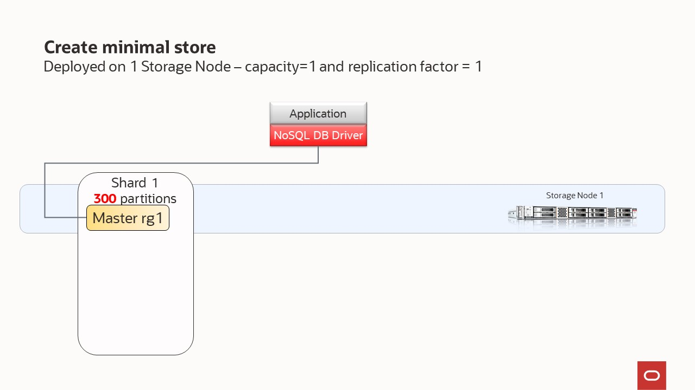
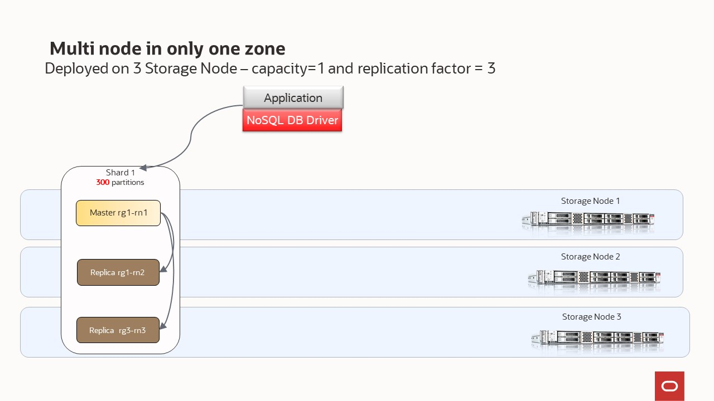

# Scenario 10 - Modify the replication factor - Elastic Expansion and Rebalancing

In this scenario, we show how to modify an existing configuration. We start with a single node, then we change the replication factor and finally we increase the capacity. 

Every **Storage Node** hosts one or more **Replication Nodes** as determined by its **capacity**. A Storage Node's capacity serves as a rough measure of the 
hardware resources associated with it (memory, CPUs, and disks). Stores can contain Storage Nodes with different capacities, and Oracle NoSQL Database
ensures that a Storage Node is assigned a proportional load size to its capacity.  As a general guideline, we want each **Replication Node** to have its own disk 
and approximately 40GB RAM maximum.  For example, if your **Storage Node** has 128 GB RAM and 2 disks, then this **Storage Node** can support 
2 **Replication Nodes** even though it has enough memory to support 3.  For this example, consider adding another disk driver to the **Storage Node**.

Your store is organized into **shards**, and **shards** contain replication nodes.  Replication nodes hold a subset of the store's data. There are two 
types of replication nodes, namely, **masters** and **replicas.** 
Each shard must contain one **master** node. The master node performs all database write activities. Each shard can also contain one or more read-only **replicas**.
The master node copies all new write activity data to the replicas. The replicas are then used to service read-only operations.  The total number of 
masters and replicas in a shard is equal to the replication factor (RF).  You can also think of RF as the number of copies of you data. For example, 
if you have RF=3, then you will have 1 master replication node and 2 replica replication nodes; with each replication node hold a copy of the data. 
The **shard** is often referred to has a replication group, or rg for short. In our diagrams, you will see notation rg1, rg2, etc. and 
this means replication group 1, replication group 2; or equivalently shard 1, shard 2, etc. 

While there can be only one master replication node per shard at any given time, any of the other replication nodes can become a master node. If the 
machine hosting the master node fails in any way, the master automatically fails over to one of the other replication nodes in the shard which is then 
promoted to master.

The goal of this example is to walk you through the steps of creating a very small store and growing that over time.  This demonstrates NoSQL's expansion
capability in a simple to understand manner.  In the first step, we will deploy a topology using 1 Storage Node, capacity=1 and replication factor = 1. 
In this case, we have only masters.  In the second step, we take this very simple topoogy and expand it to include 3 storage nodes.  This allows us to increase 
the replication factor to 3.  The final step increases the size of the storage node so it has a capacity of 3.  This will permit us to have 3 shards instead of 
the single one we have been using.   


In the previous section, we explained that configuring your store requires these steps:
- Install the sofware in a set of storage nodes
- Configure and start a set of storage Nodes
- Deploy YOUR topology
- Configure and Start Oracle NoSQL Database Proxy


## Deployed on 1 Storage Node – capacity=1 and replication factor = 1
  

`node1-nosql` |
---|
`cd $HOME/examples-nosql-cluster-deployment/script`|
`source env.sh`|
`bash stop.sh`|
`bash clean.sh`|
`bash boot.sh`|
`kv_admin load -file single-node-rf1.kvs`|

`node1-nosql` |
---|
`kv_proxy &`|

## Increase availability - modify the replication factor

In this step, we will add replicas but we will continue to mantain the same name of shards. 
- Deployed on 3 Storage Nodes – capacity=1 - RF=3, with small capacity machines the system will create 1 shard



In the previous section, we explained that configuring your store requires these steps:
- Install the sofware in a set of NEW storage nodes
- Configure and start a set of NEW storage Nodes
- Deploy YOUR topology. In this case - deploy YOUR NEW topology - Increase availability - modify the replication factor


`node1-nosql` | NEW SN ( `node2-nosql` `node3-nosql`) |
---|---|
`cd $HOME/examples-nosql-cluster-deployment/script` | `cd $HOME/examples-nosql-cluster-deployment/script` |
`source env.sh` | `source env.sh` |
-- | `bash stop.sh` | 
-- | `bash clean.sh` | 
-- | `bash boot.sh` | 
`kv_admin load -file change-rf-1-to-3.kvs` | -- |

## Elastic Expansion and Rebalancing

In the previous steps, we deployed a topology with **masters** and **replicas** but with only one shard.
In this step, we will add more capacity and expand our cluster. Depending on the combination of the number of storage nodes and their individual capacity, we will have one or multiple shards. The NoSQL Database software determines the number of shards.
- Deployed on 3 Storage Nodes – capacity=3 - RF=3, with large capacity machines the system will create 3 shards
 


Underneath the covers, the data is stored in logical collections called partitions. Every replication node contains at least one, and typically many, partitions. In our 
toplogy scripts, you can set the number partitions, or use what we have already defiend. Once a record is placed in a partition, it will stay there over the life of the 
record. Partitions can move to different replication nodes, which can be seen when rebalancing the store.

If you execute the following command at the same time that `kv_admin load -file expand-add-capacity.kvs`, you will see the process of rebalance

```bash
kv_admin verify topology
```

In the section, we will use existing nodes, so, configuring your store requires only one step:

`node1-nosql` | OTHER SN ( `node2-nosql` `node3-nosql`) |
---|---|
`cd $HOME/examples-nosql-cluster-deployment/script` | -- |
`source env.sh` |  -- |
`kv_admin load -file expand-add-capacity.kvs` | -- |
