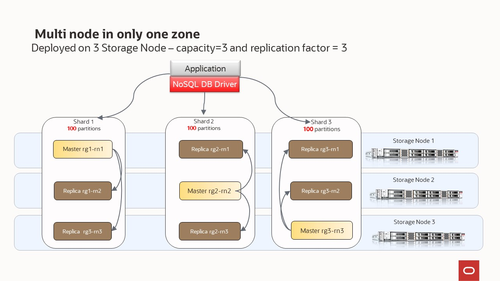

# Scenario 4 - multi node in only one zone - secure cluster

The most common scenario uses multiple Storage nodes. It is **for production environments** that require HA and business continuity.

Every **Storage Node** hosts one or more **Replication Nodes** as determined by its **capacity**. A Storage Node's capacity serves as a rough measure of the 
hardware resources associated with it (memory, CPUs, and disks). Stores can contain Storage Nodes with different capacities, and Oracle NoSQL Database
ensures that a Storage Node is assigned a proportional load size to its capacity.  As a general guideline, we want each **Replication Node** to have its own disk 
and approximately 40GB RAM maximum.  For example, if your **Storage Node** has 128 GB RAM and 2 disks, then this **Storage Node** can support 
2 **Replication Nodes** even though it has enough memory to support 3.  For this example, consider adding another disk driver to the **Storage Node**.

Your store is organized into **shards**, and **shards** contain replication nodes.  Replication nodes hold a subset of the store's data. There are two 
types of replication nodes, namely, **masters** and **replicas.** 
Each shard must contain one **master** node. The master node performs all database write activities. Each shard can also contain one or more read-only **replicas**.
The master node copies all new write activity data to the replicas. The replicas are then used to service read-only operations.  The total number of 
masters and replicas in a shard is equal to the replication factor (RF).  You can also think of RF as the number of copies of you data. For example, 
if you have RF=3, then you will have 1 master replication node and 2 replica replication nodes; with each replication node hold a copy of the data. 
The **shard** is often referred to has a replication group, or rg for short. In our diagrams, you will see notation rg1, rg2, etc. and 
this means replication group 1, replication group 2; or equivalently shard 1, shard 2, etc. 

Underneath the covers, the data is stored in logical collections called **partitions**.  Every replication node contains at least one, and typically many,
partitions.  In our toplogy scripts, you can set the number partitions, or use what we have already defiend.  Once a record is placed in a 
partition, it will stay there over the life of the record.  Partitions can move to different replication nodes, which can be seen when rebalancing the store.
As a best practice you want the number of partitions to be evenly divisible by the number of shards and we recommend at least 20 partitions per shard.  In our 
topology scripts we are using 100 partitions per shard, as this offers good flexibilty when expanding the store. 

While there can be only one master replication node per shard at any given time, any of the other replication nodes can become a master node. If the 
machine hosting the master node fails in any way, the master automatically fails over to one of the other replication nodes in the shard which is then 
promoted to master.

In this scenario, we will have **masters** and **replicas** but depending on the combination of the number of storage nodes and their individual 
capacity, we will have one or multiple shards.   The NoSQL Database software determines the number of shards.
- Deployed on 3 Storage Nodes – capacity=3 - RF=3, with large capacity machines the system will create 3 shards

You can use a secure configuration or a non-secure configuration. We recommend using the secure setup, albeit additional steps are needed during set up.

Note: In this repository, most of the scenarios are using the non-secure configuration. We have **this scenario** showing how to set up a secure configuration.
In the **Scenario 3 - multi node in only one zone - non-secure cluster**, you can see how the NoSQL Database software determines the number of shards:
- Deployed on 3 Storage Nodes – capacity=1 - RF=3, with small capacity machines the system will create 1 shard
- Deployed on 4 Storage Nodes – capacity=3 - RF=3, with large capacity machines the system will create 4 shards

You can always add security to an existing non-secure cluster.

In the previous section, we explained that configuring your store requires these steps:
- Install the sofware in a set of storage nodes
- Configure and start a set of storage Nodes
- Deploy YOUR topology
- Create users if deploying a secure cluster
- Configure and Start Oracle NoSQL Database Proxy

In this section, we will use those scripts to highlight how easy is deploy a NoSQL cluster

## Deployed on 3 Storage Nodes – capacity=3 and replication factor = 3

  

`node1-nosql` | Other SN ( `node2-nosql` `node3-nosql`) |
---|---|
`cd $HOME/examples-nosql-cluster-deployment/script` | `cd $HOME/examples-nosql-cluster-deployment/script` |
`source env.sh` | `source env.sh` |
`bash stop.sh` | `bash stop.sh` | 
`bash clean.sh` | `bash clean.sh` | 
`bash boot-default-sec.sh configure` | -- |
`bash start.sh` | -- |
`cd ; zip -r $HOME/security.zip $KVROOT/security; cd - ` | -- |
copy $HOME/security.zip from `node1-nosql` to other nodes| -- |
-- |`cd; unzip security.zip; cd -;`| -- | 
-- |`bash boot-default-sec.sh configure`| -- |
-- |`bash start.sh`| -- |
`kv_admin load -file multi-node.kvs` | -- |
`bash create-users.sh` | -- |

`node1-nosql` | 
---|
`cd $HOME/examples-nosql-cluster-deployment/script` |
`source env-proxy.sh` |
`bash clean-proxy.sh` |
`cp $KVROOT/security/proxy.zip $PROXYHOME` | 
`bash generate-self-signed-cert-http-proxy.sh |
`unzip $PROXYHOME/proxy.zip -d $PROXYHOME` | 
`http-proxy-sec &` |

