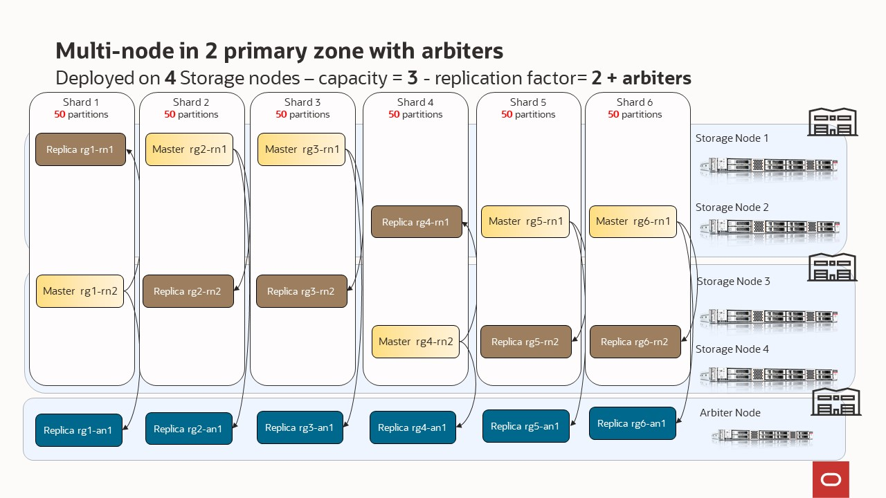

# Scenario 8 - multi node in multiple zones (2 primary) + arbiters

Every **Storage Node** hosts one or more **Replication Nodes** as determined by its **capacity**. A Storage Node's capacity serves as a rough measure of the 
hardware resources associated with it (memory, CPUs, and disks). Stores can contain Storage Nodes with different capacities, and Oracle NoSQL Database
ensures that a Storage Node is assigned a proportional load size to its capacity.  As a general guideline, we want each **Replication Node** to have its own disk 
and approximately 40GB RAM maximum.  For example, if your **Storage Node** has 128 GB RAM and 2 disks, then this **Storage Node** can support 
2 **Replication Nodes** even though it has enough memory to support 3.  For this example, consider adding another disk driver to the **Storage Node**.

Your store is organized into **shards**, and **shards** contain replication nodes.  Replication nodes hold a subset of the store's data. There are two 
types of replication nodes, namely, **masters** and **replicas.** 
Each shard must contain one **master** node. The master node performs all database write activities. Each shard can also contain one or more read-only **replicas**.
The master node copies all new write activity data to the replicas. The replicas are then used to service read-only operations.  The total number of 
masters and replicas in a shard is equal to the replication factor (RF).  You can also think of RF as the number of copies of you data. For example, 
if you have RF=3, then you will have 1 master replication node and 2 replica replication nodes; with each replication node hold a copy of the data. 
The **shard** is often referred to has a replication group, or rg for short. In our diagrams, you will see notation rg1, rg2, etc. and 
this means replication group 1, replication group 2; or equivalently shard 1, shard 2, etc. 

Underneath the covers, the data is stored in logical collections called **partitions**.  Every replication node contains at least one, and typically many,
partitions.  In our toplogy scripts, you can set the number partitions, or use what we have already defiend.  Once a record is placed in a 
partition, it will stay there over the life of the record.  Partitions can move to different replication nodes, which can be seen when rebalancing the store.
As a best practice you want the number of partitions to be evenly divisible by the number of shards and we recommend at least 20 partitions per shard.  In our 
topology scripts we are using 100 partitions per shard, as this offers good flexibilty when expanding the store. 

While there can be only one master replication node per shard at any given time, any of the other replication nodes can become a master node. If the 
machine hosting the master node fails in any way, the master automatically fails over to one of the other replication nodes in the shard which is then 
promoted to master.

We have a special node type called an arbiter node.  An arbiter node is a lightweight process that is capable of supporting write availability in 
two situations. First, when the replication factor is two and a single replication node becomes unavailable. Second, when two replication nodes are 
unable to communicate to determine which one of them is the master. The role of an arbiter node 
is to participate in elections and respond to acknowledge requests in the situations noted above.

An arbiter node does not host any data. You create a storage node with zero storage capacity to host an arbiter node. While you can allocate 
arbiter nodes on storage nodes with a capacity greater than zero, those arbiter nodes have a lower priority during allocation than those on zero 
capacity storage nodes.

The arbiter node is allocated on a storage node outside of the shard. In other words, it does not belong to a shard. An error occurs if there are not 
enough storage nodes to host an arbiter node located on a different storage node hosting shard members. The arbiter node provides write availability in 
the absence of a single storage node.  The pool of storage nodes in a zone configured to host arbiter nodes is used for allocating an arbiter node. 

In this scenario, we are showcasing a complex setup where we have 2 primary zones, no secondary zones and each primary zone has 2 storage nodes.   This
gives us a total of 4 storage nodes.  We also want to demonstrate the use of arbiters so we will use a replication factor of 2.  Each shard will need an associated arbiter node.

In the previous section, we explained that configuring your store requires these steps:
- Install the sofware in a set of storage nodes
- Configure and start a set of storage Nodes
- Deploy YOUR topology
- Configure and Start Oracle NoSQL Database Proxy

In this section, we will use those scripts to highlight how easy is deploy a NoSQL cluster
## Deployed on 4 Storage nodes – capacity = 3 - replication factor= 2 + arbiters
  

`node1-nosql` | Other SN ( `node2-nosql` `node3-nosql` `node4-nosql`) | Arbiter SN ( `arbiter-nosql`) |
---|---|---|
`cd $HOME/demo-simple-nosql-cluster/script` | `cd $HOME/demo-simple-nosql-cluster/script` |  `cd $HOME/demo-simple-nosql-cluster/script` |
`source env.sh` | `source env.sh` | `source env.sh` |
`bash stop.sh` | `bash stop.sh` | `bash stop.sh` | 
`bash clean.sh` | `bash clean.sh` | `bash clean.sh` |  
`bash boot-cap3.sh` | `bash boot-cap3.sh` |  `bash boot-arbiter.sh` | 
`kv_admin load -file multi-zone-with-arb-v2.kvs` | -- |
`kv_proxy &` | -- |
