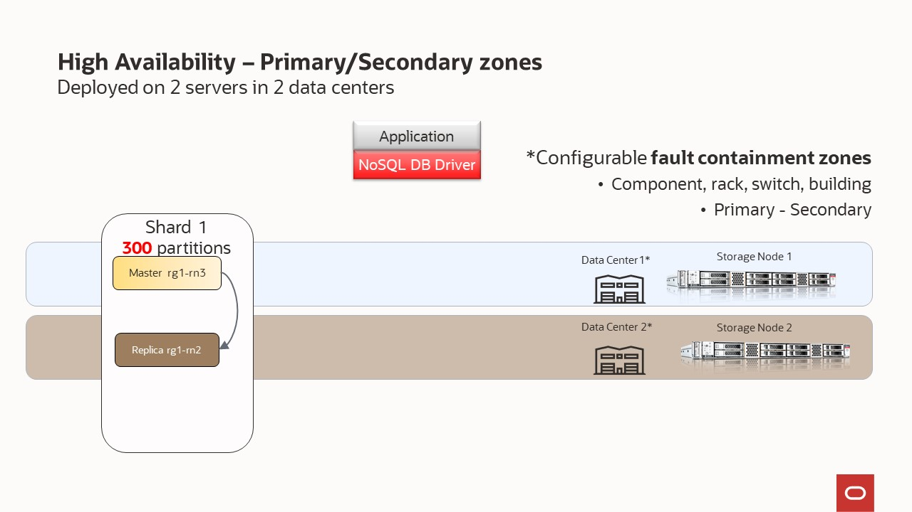
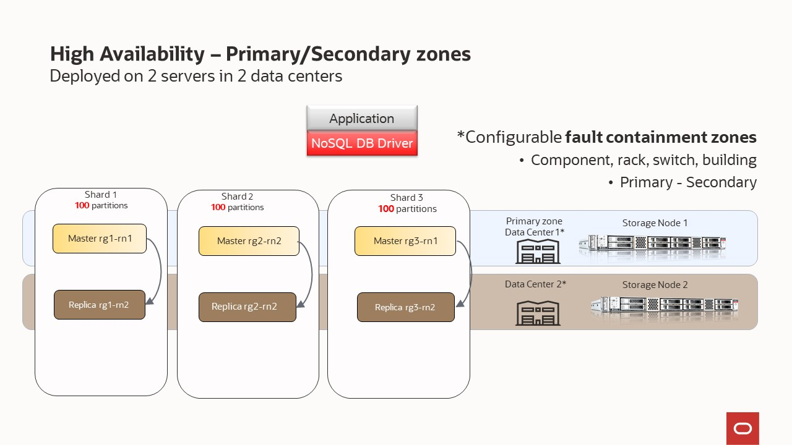
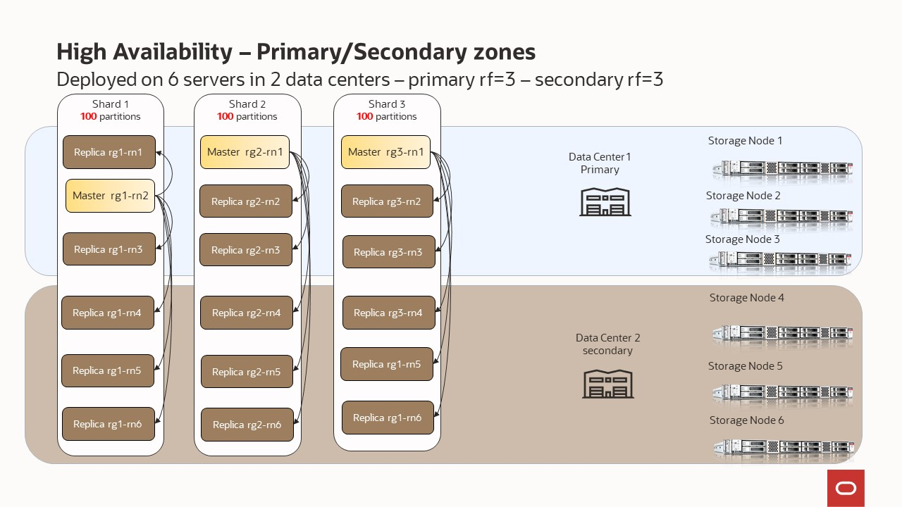

# Scenario 9 - multi node in multiple zones (1 primary/1 secondary)

Every **Storage Node** hosts one or more **Replication Nodes** as determined by its **capacity**. A Storage Node's capacity serves as a rough measure of the 
hardware resources associated with it (memory, CPUs, and disks). Stores can contain Storage Nodes with different capacities, and Oracle NoSQL Database
ensures that a Storage Node is assigned a proportional load size to its capacity.  As a general guideline, we want each **Replication Node** to have its own disk 
and approximately 40GB RAM maximum.  For example, if your **Storage Node** has 128 GB RAM and 2 disks, then this **Storage Node** can support 
2 **Replication Nodes** even though it has enough memory to support 3.  For this example, consider adding another disk driver to the **Storage Node**.

Your store is organized into **shards**, and **shards** contain replication nodes.  Replication nodes hold a subset of the store's data. There are two 
types of replication nodes, namely, **masters** and **replicas.** 
Each shard must contain one **master** node. The master node performs all database write activities. Each shard can also contain one or more read-only **replicas**.
The master node copies all new write activity data to the replicas. The replicas are then used to service read-only operations.  The total number of 
masters and replicas in a shard are equal to the replication factor (RF).  You can also think of RF as the number of copies of your data. For example, 
if you have RF=3, then you will have 1 master replication node and 2 replica replication nodes; with each replication node hold a copy of the data. 
The **shard** is often referred to has a replication group, or rg for short. In our diagrams, you will see notation rg1, rg2, etc. and 
this means replication group 1, replication group 2; or equivalently shard 1, shard 2, etc. 

Underneath the covers, the data is stored in logical collections called **partitions**.  Every replication node contains at least one, and typically many,
partitions.  In our topology scripts, you can set the number partitions, or use what we have already defined.  Once a record is placed in a 
partition, it will stay there over the life of the record.  Partitions can move to different replication nodes, which can be seen when rebalancing the store.
As a best practice you want the number of partitions to be evenly divisible by the number of shards and we recommend at least 20 partitions per shard.  In our 
topology scripts we are using 100 partitions per shard, as this offers good flexibility when expanding the store. 

While there can be only one master replication node per shard at any given time, any of the other replication nodes can become a master node. If the 
machine hosting the master node fails in any way, the master automatically fails over to one of the other replication nodes in the shard which is then 
promoted to master.

If you have multiple physical facilities, you can consider deploying your store across multiple **zones**. Multiple zones provide fault isolation 
(a fault containment zone)
and availability for your data if a single zone fails. Each zone has a copy of your complete store, including a copy of all the shards. With a 
multi-zone configuration, reads are generally always possible, because at least one replica is in every zone. Writes can also occur in the event 
of a zone loss, if the database maintains quorum.

A **zone** is a physical location that supports high-capacity network connectivity between the Storage Nodes deployed within it. Each zone has some level 
of physical separation from other zones. Typically, each zone includes redundant or backup power supplies, redundant data communications connections,
environmental controls (for example: air conditioning, fire suppression), and security devices. A zone can represent a physical data center building, the 
floor of a building, a room, pod, or rack, depending on the deployment.  You can think of **zone** as an independent data center.

Oracle recommends installing and configuring your store across multiple zones when disaster recovery (DR) is a high concern.  Multiple zones help mitigate systemic failures that affect an entire physical location, such as a large-scale power or network outage. 

There are two types of zones — **primary** and **secondary**. **Primary zones** are the default. They contain replication nodes that can serve as masters or replicas. Secondary zones 
contain replication nodes that can serve only as replicas. You can use secondary zones to make a copy of the data available at a distant location, or to maintain an extra copy of the 
data to increase redundancy or read capacity.

You can specify a different replication factor to each zone. A replication factor is quantified as one of the following:
- **Zone Replication Factor:** The number of copies, or replicas, maintained in a specific zone.
- **Primary Replication Factor:** The total number of replicas in all primary zones. This replication factor controls the number of replicas that 
participate in elections and acknowledgments.
- **Secondary Replication Factor:** The total number of replicas in all secondary zones. Secondary replicas provide additional read-only copies of the data.
- **Store Replication Factor:** Represents for all zones in the store, the total number of replicas across the entire store. 

In this scenario, we will have **masters** and **replicas** but depending on the combination of the number of storage nodes and their individual 
capacity, we will have one or multiple shards. The NoSQL Database software determines the number of shards.  Each of the different storage nodes will 
be deployed in a different data center (or at least logical for demo purposes).  The same concept in our scripts can be used when you have physically 
separated data centers.
- Deployed on 3 Storage Nodes – capacity=1 - Primary RF=3, with small capacity machines the system will create 1 shard
- Deployed on 3 Storage Nodes – capacity=3 - Primary RF=3, with large capacity machines the system will create 3 shards

If you have multiple physical facilities, you can consider deploying your store across multiple **zones**. Multiple zones provide fault isolation 
(a fault containment zone) and availability for your data if a single zone fails. With this configuration, when a zone fails, write availability 
is automatically reestablished as long as quorum is maintained.

If a zone goes down, manual procedures such as failovers can be used to recover from that situation. A failover is performed when the primary 
zone fails or has become unreachable, and a secondary zone is transitioned to take over the primary role.  You are promoting the secondary zone to be the primary 
zone. Failover may or may not result in data loss. Switchovers can be used after performing a failover (to restore the original configuration) or for planned
maintenance. A switchover is typically a role reversal between a primary zone and one of the secondary zones of the store. A switchover can also be performed 
to convert one or more zones to another type for maintenance purposes. Switchover guarantees no data loss. 

Oracle recommends installing and configuring your store across multiple zones with primary and secondary zones. In general, a primary replication factor of 3 
is adequate for most applications and is a good starting point, because 3 replicas allow write availability if a single primary zone fails. See the scenario
"multi node in multiple primary zones without affinity" for more information on primary replication factor.

Shown below, is the simplest scenario to showcase and learn how to deploy a topology with primary/secondary zones. It is for test only purposes and not 
for a production environment that requires HA and business continuity. 

In the previous section, we explained that configuring your store requires these steps:
- Install the software in a set of storage nodes
- Configure and start a set of storage Nodes
- Deploy YOUR topology
- Configure and Start Oracle NoSQL Database Proxy

In this section, we will use those scripts to highlight how easy is deploy a NoSQL cluster

## Deployed on 2 Storage Node – capacity=1 - replication factor = 1 and secondary zone
  


`node1-nosql` | Other SN ( `node2-nosql` ) |
---|---|
`cd $HOME/examples-nosql-cluster-deployment/script` | `cd $HOME/examples-nosql-cluster-deployment/script` |
`source env.sh` | `source env.sh` |
`bash stop.sh` | `bash stop.sh` | 
`bash clean.sh` | `bash clean.sh` | 
`bash boot.sh` | `bash boot.sh` | 
`kv_admin load -file primary-secondary.kvs` | -- |

`node1-nosql` |
---|
`kv_proxy &`|


## Deployed on 2 Storage Node – capacity=3 - replication factor = 1 and secondary zone
  

`node1-nosql` | Other SN ( `node2-nosql`) |
---|---|
`cd $HOME/examples-nosql-cluster-deployment/script` | `cd $HOME/examples-nosql-cluster-deployment/script` |
`source env.sh` | `source env.sh` |
`bash stop.sh` | `bash stop.sh` | 
`bash clean.sh` | `bash clean.sh` | 
`bash boot-cap3.sh` | `bash boot-cap3.sh` | 
`kv_admin load -file primary-secondary.kvs` | -- |

`node1-nosql` |
---|
`kv_proxy &`|

## Deployed on 6 Storage Node – capacity=3 - replication factor = 3 and secondary zone
  

`node1-nosql` | Other SN ( `node2-nosql node3-nosql node4-nosql node5-nosql node6-nosql`) |
---|---|
`cd $HOME/examples-nosql-cluster-deployment/script` | `cd $HOME/examples-nosql-cluster-deployment/script` |
`source env.sh` | `source env.sh` |
`bash stop.sh` | `bash stop.sh` | 
`bash clean.sh` | `bash clean.sh` | 
`bash boot-cap3.sh` | `bash boot-cap3.sh` | 
`kv_admin load -file primary-secondary-rf3.kvs` | -- |

`node1-nosql` |
---|
`kv_proxy &`|

## Administration - Switchover

````shell
cd $HOME/examples-nosql-cluster-deployment/script
kv_admin load -file maintenance.kvs
````

## Administration - Failover and Switchover

Note: For learning purposes, we recommend to test this administration task using a Deployment on 2 Storage Nodes

### Failover

#### Simulating the lost of Data Center 1

`Data Center 1`
````shell
cd $HOME/examples-nosql-cluster-deployment/script
source env.sh
bash stop.sh 
rm -rf $KVDATA
````

#### Doing a failover to Data Center 2

`Data Center 2`
````shell
kv_admin repair-admin-quorum -znname DataCenter2; 
kv_admin plan failover -znname DataCenter2 -type primary -znname DataCenter1 -type offline-secondary -wait; 
````

### Switchover

#### Simulating the restore of Data Center 1

`Data Center 1`
````shell
cd $HOME/examples-nosql-cluster-deployment/script
source env.sh
mkdir -p ${KVDATA} 
mkdir -p ${KVDATA}/disk1
mkdir -p ${KVDATA}/disk2 
mkdir -p ${KVDATA}/disk3
bash restart.sh 
````

#### Repair the topology and doing a switchover to Data Center 1

`Data Center 2`
````shell
cd $HOME/examples-nosql-cluster-deployment/script
source env.sh
kv_admin plan repair-topology -wait
kv_admin await-consistent -timeout 1800 -znname DataCenter1;
kv_admin load -file switchover.kvs
````
